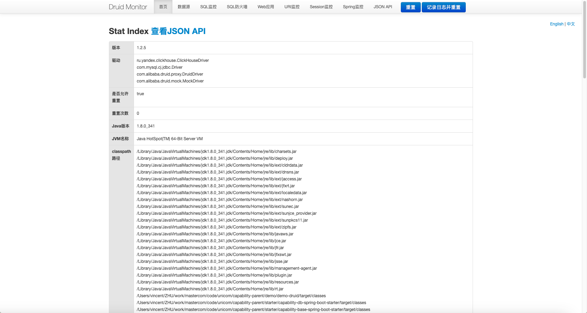
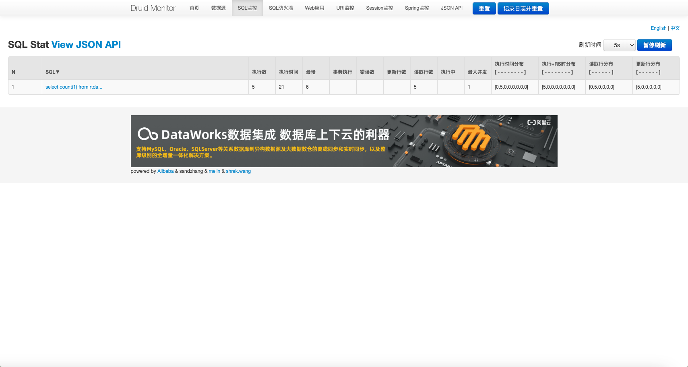

-
- ## 启用 Druid 监控页面
	- 代码创建一个 `ServletRegistrationBean<StatViewServlet>` Bean .
	  logseq.order-list-type:: number
		- ``` java
		  @Configuration
		  public class DruidMonitorConfiguration {
		  
		  	/**
		  	 * 配置一个 Servlet 路径
		  	 *
		  	 * @return
		  	 */
		  	@Bean("druidStatViewServlet")
		  	public ServletRegistrationBean<StatViewServlet> getDruidStatViewServlet() {
		  		ServletRegistrationBean<StatViewServlet> registrationBean = new ServletRegistrationBean<>(new StatViewServlet(),
		  				"/druid/*");
		  		registrationBean.addInitParameter(StatViewServlet.PARAM_NAME_ALLOW, "127.0.0.1");
		  		registrationBean.addInitParameter(StatViewServlet.PARAM_NAME_DENY, "");
		  		registrationBean.addInitParameter(StatViewServlet.PARAM_NAME_USERNAME, "mastercom");
		  		registrationBean.addInitParameter(StatViewServlet.PARAM_NAME_PASSWORD, "mastercom");
		  		registrationBean.addInitParameter(StatViewServlet.PARAM_NAME_RESET_ENABLE, "true");
		  		return registrationBean;
		  	}
		  }
		  ```
	- 浏览器访问 `http://host:port/contextPath/druid`
	  logseq.order-list-type:: number
		- 
- ## 启用 sql 监控功能
	- 在 **启用 Druid 监控页面** 的基础上，新增如下 `StatFilter` Bean
	  logseq.order-list-type:: number
		- ```java
		      @Bean
		  	public StatFilter statFilter() {
		  		StatFilter statFilter = new StatFilter();
		  		statFilter.setMergeSql(true);
		  		statFilter.setSlowSqlMillis(3000);
		  		return statFilter;
		  	}
		  ```
	- 调用接口执行 sql
	  logseq.order-list-type:: number
	- 界面中可以看到 sql 执行的一些参数
	  logseq.order-list-type:: number
		- 
	- logseq.order-list-type:: number
	-