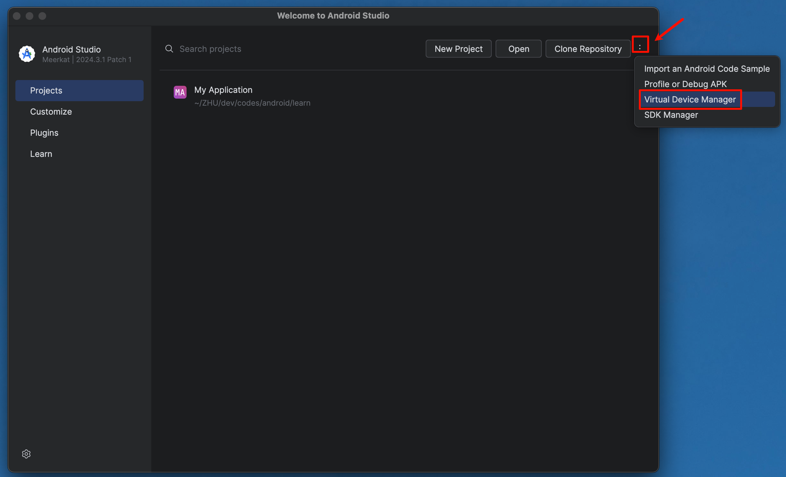
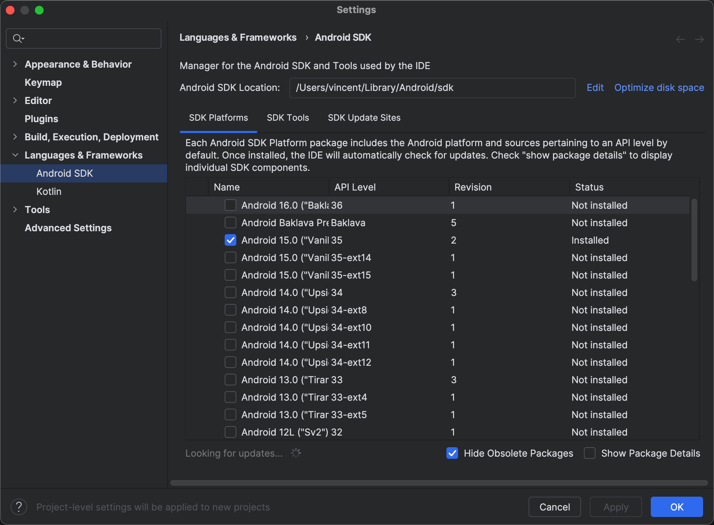
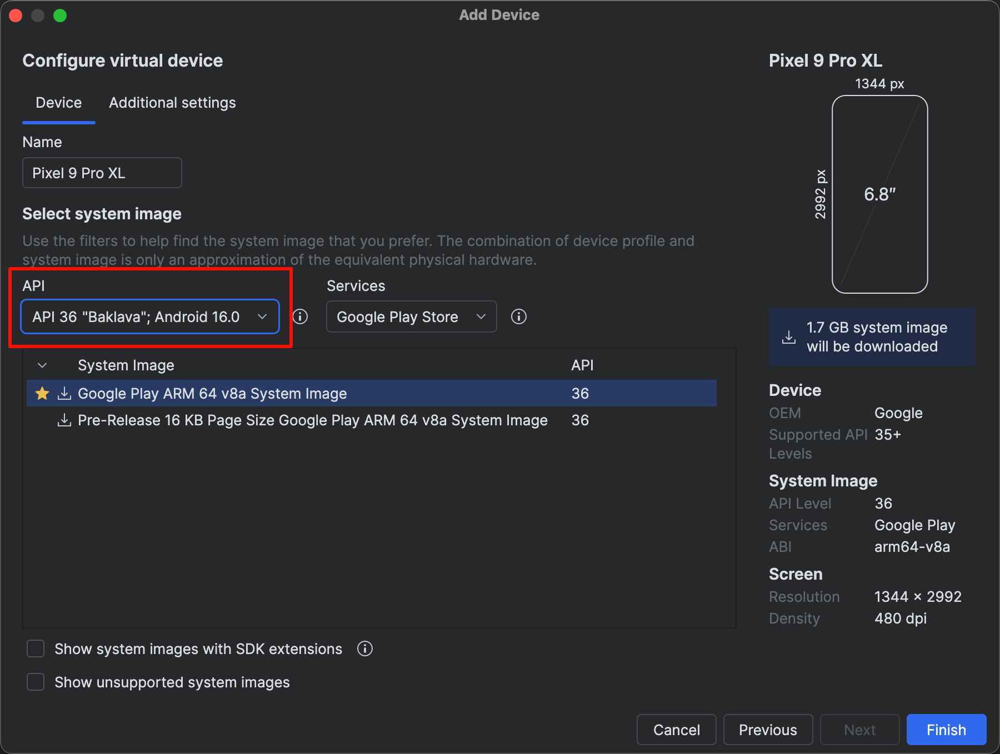

tags:: [[Android Studio]], [[Simulator]] 
---

- ## 从 Android Studio 欢迎界面进入
	- 在 Android Studio 欢迎界面, 点击右上角三个点.
		- {:height 596, :width 697}
	- 可以发现有 `Virtual Device Manager` 和 `SDK Manager` 两个条目.
	- `SDK Manager` : 是指 Android SDK 版本管理, 是创建模拟器需要的 Android 底层依赖.
		- {:height 605, :width 657}
	- `Virtual Device Manager` : 虚拟设备 (模拟器) 的管理.
		- 这里的 API , 就是 Android SDK 的版本, 可以选择不同版本.
		- 安装如果很慢, 记得开启代理.
		- {:height 517, :width 654}
	-