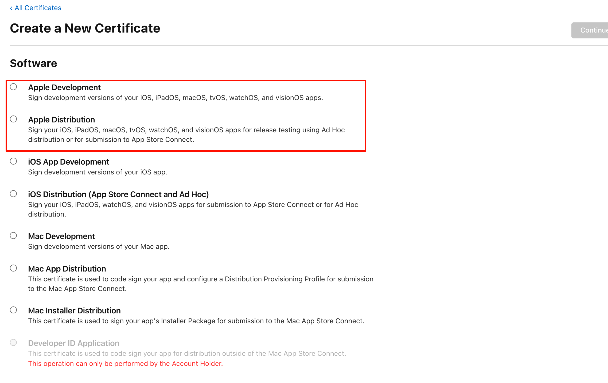
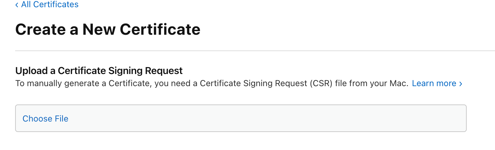
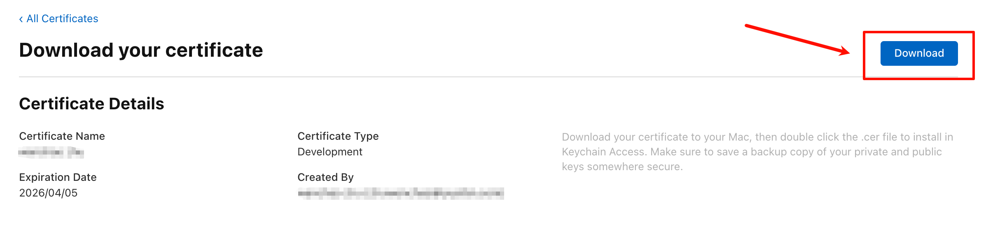

tags:: [[Apple Developer]] 
---

- ## Identifiers
	- App ID , Services ID 等唯一标识.
	- App ID 一般命名为 `com.domainname.appname` .
- ## Certificates
	- ### 什么是 Certificate
		- 即 证书, 是 Apple 颁发给开发者, 用于验证开发者身份的文件.
		- 常见证书:
			- `Development` 证书 : 用于开发测试 .
			  logseq.order-list-type:: number
			- `Distribution` 证书 : 用于发布到 App Store .
			  logseq.order-list-type:: number
	- ### 创建一个 Certificate
		- 选择证书类型.
		  logseq.order-list-type:: number
			- {:height 567, :width 660}
		- 在 macOS 创建一个 Certificate Signing Request (CSR) 文件, 并上传.
		  logseq.order-list-type:: number
			- 参见: [[Keychain Access Certificate]] 进行创建
			- {:height 202, :width 537}
		- 下载并安装 Certificate.
		  logseq.order-list-type:: number
			- {:height 236, :width 913}
			- 参见: [[Keychain Access Certificate]]
	- ### 导出证书为 .p12 文件
		- 参见: [[Keychain Access Certificate]]
- ## Profiles
- ## Keys
- ## Devices
	-
-