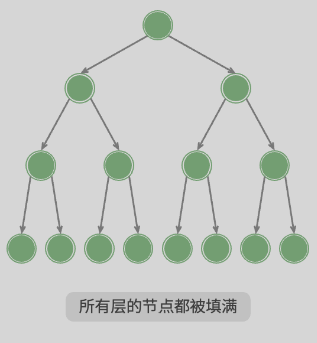
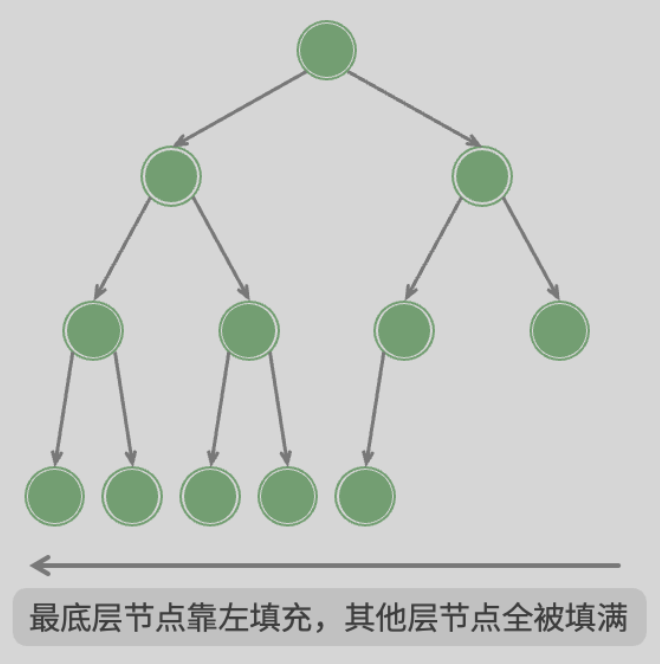
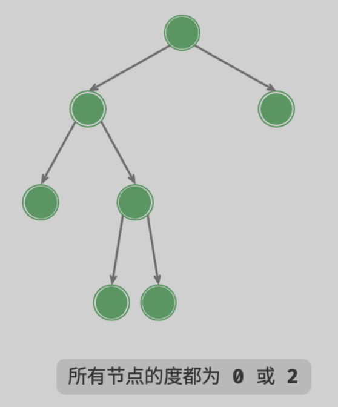
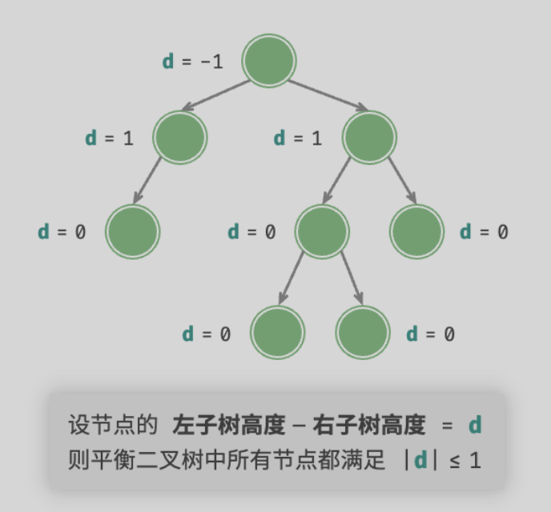
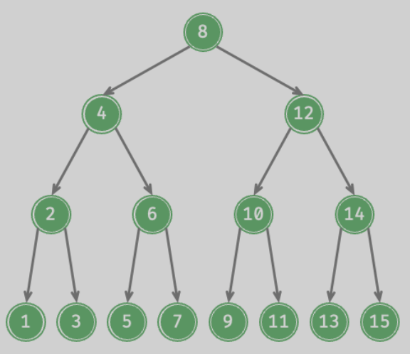

alias:: [[二叉树]]
tags:: [[Algorithm]], [[Tree]]
---

- ## 各种二叉树
	- ### 完美二叉树 (Perfect Binary Tree)
		- {:height 279, :width 246}
	- ### 完全二叉树 (Complete Binary Tree)
		- {:height 279, :width 246}
	- ### 完满二叉树 (Full Binary Tree)
		- {:height 279, :width 246}
	- ### 平衡二叉树 (Balanced Binary Tree)
		- {:height 325, :width 330}
	- ### 二叉搜索树 (Binary Search Tree, BST)
		- 对于根节点，左子树中所有节点的值 < 根节点的值 < 右子树中所有节点的值。
		  logseq.order-list-type:: number
		- 任意节点的左、右子树也是二叉搜索树，即同样满足条件 `1.` 。
		  logseq.order-list-type:: number
		- {:height 247, :width 330}
	- ### AVL 树
		- 由 G. M. Adelson-Velsky 和 E. M. Landis 首次提出，故得此名。
		- 就是在 Binary Search Tree 的基础上，增删节点时，移动相关节点，使树保持为 Balanced Binary Tree .
		- 所以 AVL 树是一种 Balanced Binary Search Tree (平衡二叉搜索树) .
	- ### 红黑树
		-
- ---
- ## 参考
	- [Hello 算法 - 二叉树](https://www.hello-algo.com/chapter_tree/binary_tree/)
	  logseq.order-list-type:: number
	- logseq.order-list-type:: number