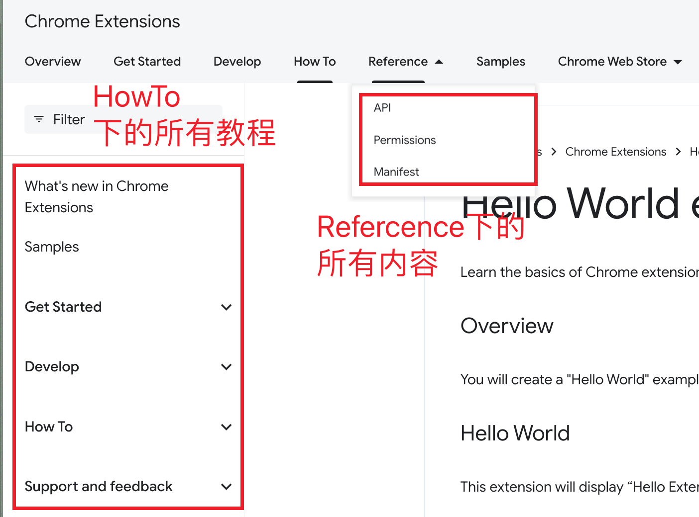

tags:: [[Browser Extension]], [[Chrome]]
---

- ## 学习路线
	- 基本概念学习: [[Chrome Extension Concept]]
	  logseq.order-list-type:: number
	-
	- [[Chrome Extension Permisson]]
	- 常见问题
		- [[如何在 Chrome 扩展中使用 nodejs 模块]]
		- [[如何跨域访问 localstorage]]
		- [[如何给 iframe 注入 JS]]
		-
- ## 学习进度
	- 2023-11-12
		- 目前学习完了[Get Started Guide](https://developer.chrome.com/docs/extensions/getstarted/) ==建议重学==
		- 建议接下来学习: [Debug extensions](https://developer.chrome.com/docs/extensions/get-started/tutorial/debug)
	- 2024
		- 学完 [Hello World](https://developer.chrome.com/docs/extensions/get-started/tutorial/hello-world)
- ## 官网资料
	- [Extension Doc Home](https://developer.chrome.com/docs/extensions/)
		- {:height 310, :width 326}
		- 看官方文档，只需看图中框出的两大内容即可
		- Tutorials
			- [Get Started Guide](https://developer.chrome.com/docs/extensions/get-started)
				- [Hello World](https://developer.chrome.com/docs/extensions/get-started/tutorial/hello-world)
		- Reference
			- [API reference](https://developer.chrome.com/docs/extensions/reference/api)
			- [Manifest reference](https://developer.chrome.com/docs/extensions/reference/manifest)
			- [Permissions reference](https://developer.chrome.com/docs/extensions/reference/permissions-list)
- ## 第三方资料
	- ### 官方文档翻译
		- [Chrome 扩展V3 中文文档](https://doc.yilijishu.info/chrome/)