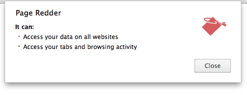
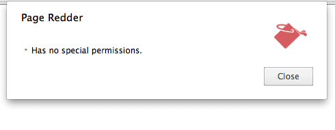

## activeTab permission
	- ==参考:==
		- [Inject scripts into the active tab#Step 3: Enable the extension action](https://developer.chrome.com/docs/extensions/get-started/tutorial/scripts-activetab#step-3)
		  logseq.order-list-type:: number
		- [The activeTab permission](https://developer.chrome.com/docs/extensions/develop/concepts/activeTab)
		  logseq.order-list-type:: number
	- ### Introduction
		- `activeTab` permission 可以赋予插件 *临时访问当前页面* 的权限.
		- 当用户在当前这个 `tab` , 这个权限一直持续, 直到如下几种情况, 权限才被取消:
			- 用户离开当前 `tab` .
			  logseq.order-list-type:: number
			- 用户关闭当前 `tab` .
			  logseq.order-list-type:: number
			- 当前 `tab` 的 `origin` (由 **协议//:域名:端口** 唯一确定) 改变.
			  logseq.order-list-type:: number
		- 如果不配置这个权限, 可能需要配置 `<all_urls>` pattern 以匹配所有网站, 这样的话, 安装插件时将产生 permission warning .
			- Without "activeTab":
				- {:height 198, :width 490}
			- With "activeTab":
				- 
	- ### Enable activeTab permission
		- 需要在 `manifest.json` 中声明 `activeTab` 权限.
			- ``` json
			  {
			    ...
			    "permissions": ["activeTab"],
			    ...
			  }
			  ```
		- 如下几种情况, 可以开启 `activeTab` 权限:
			- Executing an [action](https://developer.chrome.com/docs/extensions/reference/api/action) (toolbar 上的 icon, 包括点击 icon 和打开 popup)
			  logseq.order-list-type:: number
			- Executing a [context menu item](https://developer.chrome.com/docs/extensions/reference/api/contextMenus) (右键菜单)
			  logseq.order-list-type:: number
			- Executing a keyboard shortcut from the [commands API](https://developer.chrome.com/docs/extensions/reference/api/commands) (快捷键)
			  logseq.order-list-type:: number
			- Accepting a suggestion from the [omnibox API](https://developer.chrome.com/docs/extensions/reference/api/omnibox) (搜索框)
			  logseq.order-list-type:: number
	- ### What activeTab allows
		- 执行 `scripting.insertCSS()` 和 `scripting.executeScript()` (需要配置 `scripting` 权限).
		  logseq.order-list-type:: number
		- 通过 Chrome API 返回的 [`tabs.Tab`](https://developer.chrome.com/docs/extensions/reference/api/tabs#type-Tab) 对象, 可以获取当前 tab 的 URL, title, favicon 等, 插件临时获取 host permission .
		  logseq.order-list-type:: number
		- 通过使用`chrome.webRequest` API , 拦截当前 tab 到 当前 tab 的 `main frame origin` 的请求, 插件临时获取 `main frame origin` 的 host permissions .
		  logseq.order-list-type:: number
	-
	-
	-
- ---
- ## 参考
	-
	- logseq.order-list-type:: number