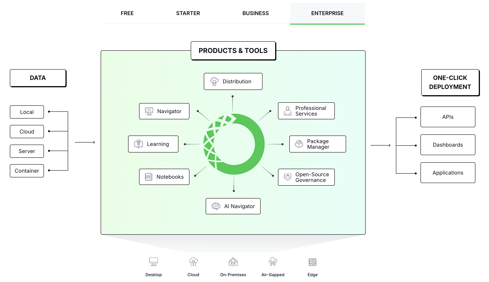

tags:: [[Conda]], [[Anaconda]], [[Miniconda]]
---

- ## Anaconda 是啥
	- 参考: [Anaconda Blogs - What’s in a Name? Clarifying the Anaconda Metapackage](https://www.anaconda.com/blog/whats-in-a-name-clarifying-the-anaconda-metapackage)
	- Anaconda 有如下含义:
	- ### Anaconda 公司
		- 参见: [Anaconda 官网](https://www.anaconda.com/)
		- Anaconda 是一家提供 Data Science 和 AI 相关开发服务的公司.
		- Anaconda 公司大致提供如下产品 (图源: [Anaconda Products](https://www.anaconda.com/products) ):
			- {:height 486, :width 685}
			- Distribution 即 Anaconda Distribution .
			- Navigator 即 Anaconda 提供的一个可视化面板, 可以管理 Anaconda 安装的软件.
			- Notebooks 即 Anaconda 内置的 Jupyter Notebook .
	- ### Anaconda Distribution 与 Anaconda Installer
		- Anaconda Distribution = Anaconda Installer ( 即 上图中的 Distribution)
		- Anaconda Distribution 是 Anaconda 公司发布的 Python 编程环境安装程序, 专注于数据科学.
		- Anaconda Distribution 包含如下内容:
			- Conda , 包管理工具.
			  logseq.order-list-type:: number
			- Anaconda 重新打包的 CPython .
			  logseq.order-list-type:: number
			- pandas, scikit-learn, scipy 等科学计算相关的包 和 其他一些有用的包 (参见: [Anaconda Distribution 内置的包](https://www.anaconda.com/open-source) ) .
			  logseq.order-list-type:: number
			- 图形化界面.
			  logseq.order-list-type:: number
		- 安装程序种类:
			- .pkg 安装程序: 适用于 MacOS
			- .sh 安装程序: 适用于 MacOS 和 Linux
			- .exe 安装程序: 适用于 Windows
	- ### Anaconda Metapackage
		- 每一个 Anaconda Distribution 版本, 都对应着一组特定版本的包的集合.
		- 这个特定版本的包的集合, 被封装在 Anaconda Metapackage 中.
			- 之所以称之为 Metapackage , 是因为它不包含任何文件, 只是管理了一组依赖 (类似 Maven 中 POM 格式的包) .
		- 在构建 Anaconda Distribution 时:
			- 首先, 制作 Anaconda Metapackage ;
			- 然后, 根据 Anaconda Metapackage 的信息, 将对应版本的依赖包放入 Distribution .
	- ### Anaconda Enterprise
		- Anaconda 企业服务: [Anaconda Enterprise](https://www.anaconda.com/enterprise/) ==我们开发无需关注==
	- ### Red Hat Anaconda
		- Red Hat Enterprise Linux 安装程序, 也被命名为 Anaconda : [Chapter 8. Installing Using Anaconda](https://docs.redhat.com/en/documentation/red_hat_enterprise_linux/7/html/installation_guide/chap-installing-using-anaconda-x86)
		- 这个 Anaconda 与 Anaconda 公司的 Anaconda 无关.
- ## Conda 是啥
	- 参考: [Conda FAQ - Why does conda have so many meanings in different contexts?](https://conda.org/learn/faq#why-does-conda-have-so-many-meanings-in-different-contexts)
	- Conda 由 Anaconda 公司开发并开源.
	- ### Conda 是一个包管理工具
		- Conda 可以管理任何语言的包, 但是目前来看 (2025-03-30) , 主要还是服务于 Python .
			- 注意: PYPI 的包, 不能直接被 Conda 管理, 需要进行专门的打包, 才能被 Conda 管理; 所以 Conda 需要有自己的 Registry .
	- ### Conda 是一个环境管理工具
	- ### 总结
		- Conda =  包管理工具 + 环境管理工具 (环境中可以任意版本的 Python) + 一些必要的底层库
- ## Miniconda
	-
- 参考:
	- 2. https://www.cnblogs.com/blackcat-meow/p/10504680.html
	  3. https://www.cnblogs.com/mishdong123rousi/p/9646705.html
-
- #### Miniconda
  
  Miniconda 功能等同于 Anaconda ，但它只包含 Anaconda 最基本的内容—— python 与 conda ，以及必要的依赖项，所占空间小于 Anaconda 。
- #### 简单区分
  
  https://stackoverflow.com/a/58147674/11249244
  
  ```crystal
  Miniconda installer = Python + `conda`
  
  Anaconda installer = Python + `conda` + meta package `anaconda`
  
  meta Python pkg `anaconda` = about 160 other Python packages for daily use in data science
  
  Anaconda installer = Miniconda installer + `conda install anaconda`
  
  # 类似maven中的聚合工程（本身没有代码，只是引用一些依赖）
  Meta packages, are packages that do NOT contain actual softwares and simply depend on other packages to be installed. 
  ```
- `conda` 不是一个命令行工具，他是一个 `Python` 包，所以他不能下载直接使用，这里就需要用到 `Anaconda` 和 `Miniconda` 。
- `Miniconda` 执行 `conda install anaconda` 即可让 `Mniconda` 变成 `Anaconda` ，只是文件夹名称不同。
- #### Miniforge
- 与 Miniconda 类似，不过在有些平台 (如 ARMv8 64-bit、aarch64) Miniconda 不提供适配，但是 Miniforge 提供。
-