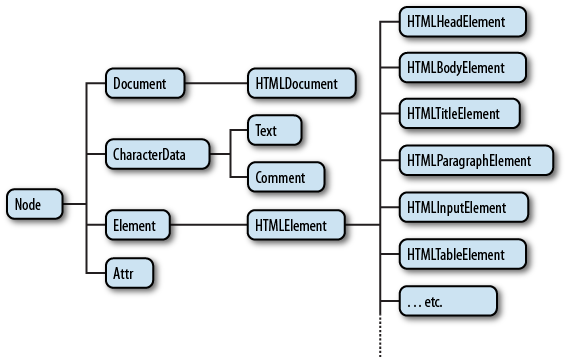
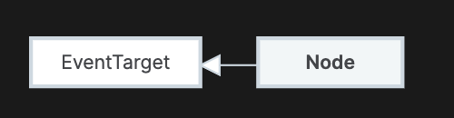
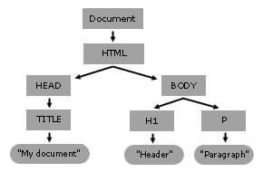
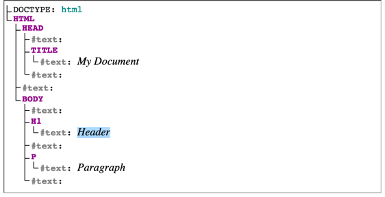

tags:: [[DOM]]
---

- ## Fundamental Data Types
	- 参考: [MDN - Introduction to DOM - Fundamental data types](https://developer.mozilla.org/en-US/docs/Web/API/Document_Object_Model/Introduction#fundamental_data_types)
	- 以下是 DOM API 的基本数据类型，属于接口类型，并非具体的实现，只包含 DOM 公共属性和方法。
	- ### Node
		- 参见: [MDN - Wen API - Node](https://developer.mozilla.org/en-US/docs/Web/API/Node)
		- 文档对象本身和文档中的每个对象都属于某种类型的 `node` ，都继承自 `Node` 接口 。
		- Node 的继承关系：
			- Node
				- Document
				- Element
				- DocumentFragment
				- Attr
				- CharacterData
					- Text
					- Comment
					- CDATASection
					- ProcessingInstruction
				- DocumentType
			- 
			- [图片来源](https://stackoverflow.com/questions/55924114/where-can-i-find-a-complete-description-of-javascript-dom-class-hierarchy)
	- ### Document
		- 参见: [MDN - Web API - Document](https://developer.mozilla.org/en-US/docs/Web/API/Document)
		- `Document` 继承自 `Node` 。
		- `Document` 代表整个文档内容。
			- 一个文档，只有一个 `document` 对象。
			- 当一个成员返回 `document` 对象，那么它就是 `root document object` 自身。
		- `Document` 接口只包含 DOM 文档共有的方法和属性。
			- HTML 文档的 `HTMLDocument` 以及 XML 和 SVG 文档的 `XMLDocument` 都继承自 `Document` 接口。
	- ### Element
		- 参见: [MDN - Web API - ELement](https://developer.mozilla.org/en-US/docs/Web/API/Element#instance_methods)
		- `Element` 继承自 `Node` 。
		- `Element` 接口包含 DOM 元素共有的方法和属性。
			- HTML DOM 的 `HTMLELement` 和 SVG DOM 的 `SVGElement` 都继承自 `Element` 接口。
			- 使用 `document.createElement()` 方法可以创建一个 `Element` 对象实例。
	- ### NodeList
		- `NodeList` 是 `Node` 的集合。
		- 进一步学习: [[DOM API/NodeList]]
	- ### Attr
		- 表示页面元素 (Element) 的属性 (Attribute) 。
		  id:: 67b08b26-8110-4acf-9805-068cb8d71ffe
		- 进一步学习: [[DOM API/Attr]]
	- ### NamedNodeMap
		- [MDN - Web API - NamedNodeMap](https://developer.mozilla.org/en-US/docs/Web/API/NamedNodeMap)
		- 与 `NodeList` 类似， `NamedNodeMap` 表示 `Attr` 的集合。
			- 但与 `NodeList` 不同的是， `NamedNodeMap` 内部的对象没有特定顺序，即便可以使用索引来访问。
		- `NamedNodeMap` 对象可以通过 `Element.attributes` 属性获取。
		- `NamedNodeMap` 是动态的 (Live) 。
			- 如果文档内容有修改， `NamedNodeMap` 对象相应的值也会动态修改。
- ## EventTarget
	- 参见: [MDN - Web API - EventTarget](https://developer.mozilla.org/en-US/docs/Web/API/EventTarget)
	- `EventTarget` 接口可以接收事件、添加事件侦听器和移除事件侦听器。
	- `Node` 继承了 `EventTarget`
		- 
		- 图片来源: [MDN - Wen API - Node](https://developer.mozilla.org/en-US/docs/Web/API/Node)
- ## JavaScript 如何查看继承关系
	- ``` js
	  // 原型链
	  document.__proto__.__proto__
	  
	  // instanceof 关键字
	  document instanceof Node
	  ```
- ## DOM 常用 API
	- document.querySelector()
	- document.querySelectorAll()
	- document.createElement()
	- Element.innerHTML
	- Element.setAttribute()
	- Element.getAttribute()
	- EventTarget.addEventListener()
	- HTMLElement.style
	- Node.appendChild()
	- window.onload
	- window.scrollTo()
- ## DOM Tree
	- DOM 树是一种树形结构，用来表示文档的结构，其每个节点都表示文档中的一个内容。
	- 示例：
		- ``` html
		  <!doctype html>
		  <html lang="en">
		    <head>
		      <title>My Document</title>
		    </head>
		    <body>
		      <h1>Header</h1>
		      <p>Paragraph</p>
		    </body>
		  </html>
		  ```
	- 如上文档，可以用下图表示：
		- 
	- 当网页浏览器解析 HTML 文档时，它会构建一个 DOM 树，然后使用它来显示文档。
	- 上图为了简化，去掉了 `#text` 节点，真实 DOM 树如下：
		- {:height 296, :width 562}
- ## 参考
	- logseq.order-list-type:: number
-