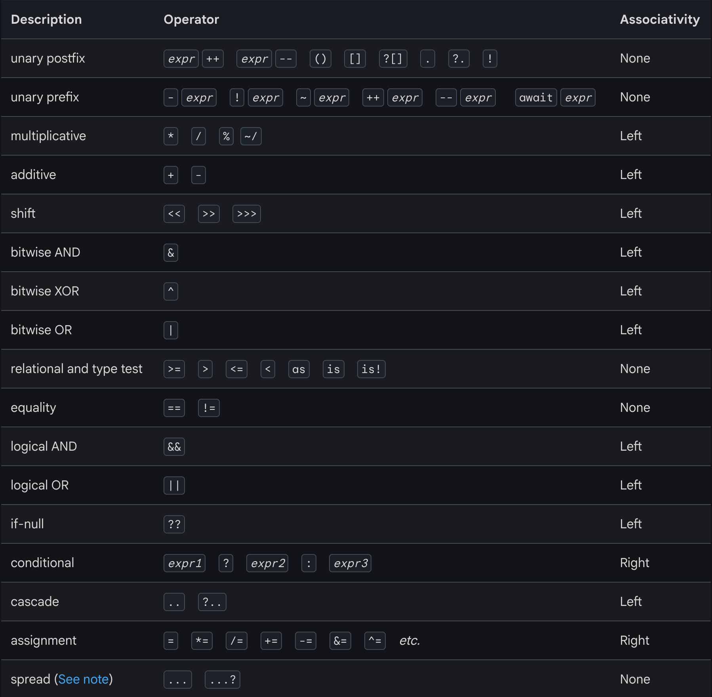

tags:: [[Dart]]
---

- ## 总览
	- {:height 723, :width 671}
	- [图源](https://dart.dev/language/operators)
	- 表中操作符的优先级, 从上往下是递减的 (即位置越高的操作符, 其优先级越高, 计算时先计算)
		- **Associativity** 的含义参见: [[Operator Associativity]]
- ## 参考
	- [Dart Docs - Operators](https://dart.dev/language/operators)
	  logseq.order-list-type:: number
	-