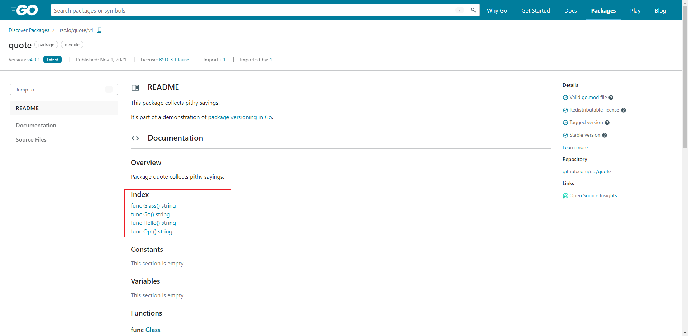

## 安装Go
	- **参考：** [Go官方文档](https://go.dev/doc/install)
	- ### Windows
		- #### 使用安装程序安装
			- [下载安装程序](https://go.dev/dl/)
			- 双击下载的 `gox.xx.windows-amd64.msi` ，选择安装路径，无脑下一步。
			- 安装完成后，命令行输入 `go version` 即可查看安装的版本（安装程序已经帮我们自动配置好了 **环境变量** ）。
			- ```sh
			  C:\Users\nigre>go version
			  go version go1.18 windows/amd64
			  ```
		- #### 编译源代码安装
			- [编译源代码安装](https://go.dev/doc/install/source)
- ## Go环境配置
	- ### 镜像配置
		- 不配置镜像，就无法下载 **外部的依赖包** 。
		- 执行如下命令：
			- ```sh
			  go env -w GO111MODULE=on
			  # 首选 https://goproxy.cn ，其他镜像可能出现问题
			  go env -w GOPROXY=https://goproxy.cn
			  ```
		- 执行 `go env` 可以查看所有的环境配置，用户的环境配置保存在 `%USERPROFILE%\AppData\Roaming\go\env`  文件。
		- **可用镜像：**
			- [官方镜像](https://goproxy.io/)
			- [七牛云 CDN goproxy.cn](https://goproxy.cn/) ([项目仓库](https://github.com/goproxy/goproxy.cn)) ==首选==
			- [阿里云镜像](https://mirrors.aliyun.com/goproxy/)
	- ### 本地依赖库配置
		- 安装程序帮我们设置了一个用户级的环境变量 `GOPATH` ，我们可以修改它为自定义地址： `E:\devtools\repos\go\public` 。
		- {:height 274, :width 592}
		- 以防万一，我们可以再设置一个系统级的环境变量 `GOPATH` （实际是用户的环境变量优先级更高）。
		- 执行 `go env` 可以查看配置是否成功。
		- 修改 `GOPATH` 后，发现 `go env` 结果中的 `GOMODCACHE` 也自动变为了 `{GOPATH}\pkg\mod` 。
- ## Hello World
	- **参考：** [Go 官方文档 - getting-started](https://go.dev/doc/tutorial/getting-started)
	- 新建一个 `hello` 文件夹。
	  logseq.order-list-type:: number
	  id:: 66163f9e-3e56-49ac-a39f-ae7f752b18ff
	- 在 `hello/` 下执行 `go mod init example/hello` ，以声明自身的 `模块路径` 。
	  logseq.order-list-type:: number
		- ```sh
		  E:\codes\go\learn\hello>go mod init example/hello
		  go: creating new go.mod: module example/hello
		  ```****
		- 执行后会在目录下生成一个 `go.mod` 文件，内容如下：
		- ```sh
		  module example/hello
		  
		  go 1.18
		  ```
	- 新建 `hello.go` 文件，输入如下内容：
	  logseq.order-list-type:: number
		- ```go
		  package main
		  
		  import "fmt"
		  
		  func main() {
		     fmt.Println("Hello, World!")
		  }
		  ```
		- 以上代码主要干了这几件事：
			- 声明了该文件 ( `hello.go` ) 所属的包为 `main` 。
			- 导入了 `fmt` 包（包含了 **格式化文本** 的函数，当然包括了 **打印文本到控制台** ）。
			- 实现了一个打印文本到控制台的 `main` 函数（当运行一个包时，会默认执行它的 `main` 函数）。
	- 执行 `go run .` 或者 `go run hello.go` 即可运行上述代码。
	  logseq.order-list-type:: number
		- ```sh
		  E:\codes\go\learn\hello>go run .
		  Hello, World!
		  ```
		- `go run .` 表示执行当前目录下的 `main` 函数，若有其他文件也定义了 `main` 函数，则会报错。
- ## 调用外部函数
	- **参考：** [Go 官方文档 - getting-started](https://go.dev/doc/tutorial/getting-started)
	- 访问 [Go Packages](http://pkg.go.dev/) ，搜索 `rsc.io/quote` ，进入 [rsc.io/quote 的 v4 版本](https://pkg.go.dev/rsc.io/quote/v4) ，可以看到页面中显示了我们可以调用的函数。
	- 
	- 新建 `quote.go` 文件，输入如下内容：
	  logseq.order-list-type:: number
		- ``` go
		  package main
		  
		  import "fmt"
		  import "rsc.io/quote"
		  
		  func main() {
		     fmt.Println(quote.Go())
		  }
		  ```
		- 导入 `rsc.io/quote` 包，并调用 `Go()` 方法。
	- 执行 `go mod tidy` 以下载依赖包（在国内需要先设置镜像）。
	  logseq.order-list-type:: number
		- ```sh
		  E:\codes\go\learn\hello>go mod tidy
		  go: finding module for package rsc.io/quote
		  go: downloading rsc.io/quote v1.5.2
		  go: found rsc.io/quote in rsc.io/quote v1.5.2
		  ```
		- 执行后，在当前目录下生成了一个 `go.sum` 文件。
		- 同时， `go.mod` 文件也新增了内容，列举了本模块的依赖。
			- ```go
			  module example/hello
			  - go 1.18
			  - require rsc.io/quote v1.5.2
			  - require (
			  golang.org/x/text v0.0.0-20170915032832-14c0d48ead0c // indirect
			  rsc.io/sampler v1.3.0 // indirect
			  )
			  ```
		- 执行 `go run quote.go` 以执行上述代码。
			- ```sh
			  E:\codes\go\learn\hello>go run quote.go
			  Don't communicate by sharing memory, share memory by communicating.
			  ```
- ## 参考
	- [Go 官方文档 - getting-started](https://go.dev/doc/tutorial/getting-started)
	  logseq.order-list-type:: number
-