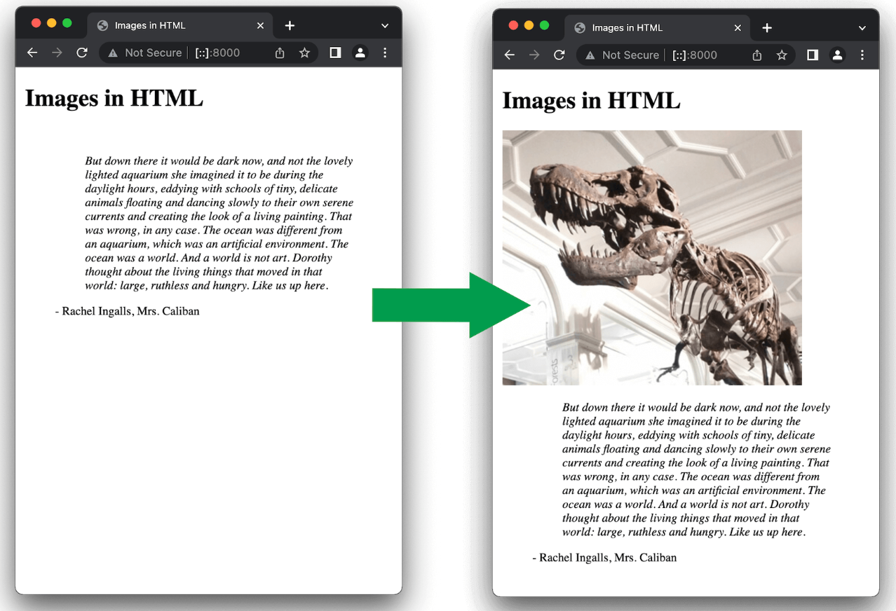
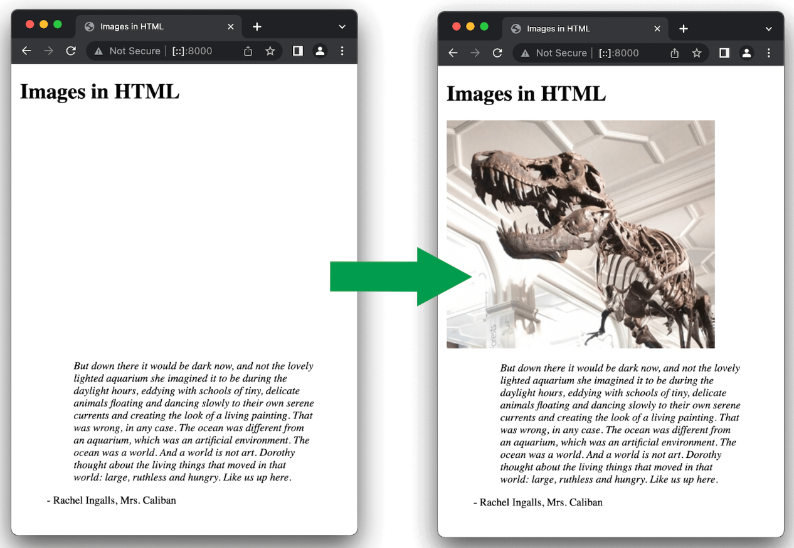

tags:: [[HTML]]
---

- ## 概述
	- ### 语法
		- 这是一个 `void element/empty element` (没有子元素，没有结束标签)
		- ```html
		  
		  
		  ```
	- ### 关于 SEO
		- 为了SEO，文件名称要有 **可读性** 。比如 `dinosaur.jpg` 好于 `img835.jpg` 。
	- ### 关于 hotlinking
		- 未经授权不要使用别人网站的图片地址 (这被称为 **hotlinking** )。
			- 这样做会导致别人需要承担图片访问的流量，而且你也不能保证图片不会被删除或被替换。
	- ### 关于版权
		- 你使用的图片最好满足以下条件之一：
			- 你 **拥有** 这张图片。
			  logseq.order-list-type:: number
			- 你有来自图片拥有者明确的、书面的 **许可** 。
			  logseq.order-list-type:: number
			- 你有充分的证据证明这张图片是在 **公共领域** 的 (即可随意使用) 。
			  logseq.order-list-type:: number
	- ### 关于绝对路径
		- 像如下这种 **绝对路径** 最好不要出现，因为：
			- 如果使用简单的部署，你需要将你的 **图片** 和 你的 **网站** 部署到同一台服务器。
			- 如果使用高级的部署，你需要使用 [CDN (Content Delivery Network)](https://developer.mozilla.org/en-US/docs/Glossary/CDN) 去分发你的 **图片** 。
		- ```html
		  
		  ```
- ## alt
	- ### alt 使用
		- `alt` 属性用于 **图片无法展示** 或 **由于网速过慢导致渲染时间比较长** 时的文本展示。
		- ```html
		  
		  ```
		- 你可以通过错误拼写图片名称来查看效果。
	- ### alt 什么时候起作用
		- `screen reader` 能够听到这个内容；同时这个描述性的文字对其他用户也有用。
		  logseq.order-list-type:: number
		- 路径拼写错误。
		  logseq.order-list-type:: number
		- 浏览器不支持图片类型，比如 文本浏览器 [Lynx](https://en.wikipedia.org/wiki/Lynx_(web_browser)) 。
		  logseq.order-list-type:: number
		- 搜索引擎会匹配 alt 中的内容。
		  logseq.order-list-type:: number
		- 用户关掉了图片显示，以减少数据传输量或减少干扰，特别是手机用户或网络带宽限制或昂贵的地方。
		  logseq.order-list-type:: number
	- ### alt 应该写什么
		- alt 应该写什么，这取决于图片的用途：
		- **Decoration (装饰)** :
			- 如果图片只是装饰，应该使用 CSS background images (见下文) ，而不是用 HTML  , 这样的话, **screen reader** 就会去读它.
			- 如果图片不是内容的一部分, **screen reader** 没必要浪费时间去读它.
			- 如果非要使用 HTML  , 则 alt 应该是 `alt=""` .
		- **Content (内容)** :
			- 如果你的图片提供了重要内容，最好在 `alt` 中简短说明.
			- 更好的方式，是在正文中说明图片内容，这个时候可以设置 `alt=""` .
				- 否则，如果图片丢失，正文中将出现两份一样的内容.
		- **Link (链接)** :
			- 如果图片被嵌套在 <a> 中作为链接，则描述可以写在 `` 的 `alt` 属性，也可以卸载 `<a>` 的 content 中.
		- **Text (文本)** :
			- 最好不要用图片来展示文本.
				- 比如你可能因为 header 需要一些特殊效果，就用图片来代替, 最好不要这么做，尽量使用 CSS.
			- 如果你不得不这么做，还是应该在 `alt` 中提供描述.
- ## width and height
	- ``` html
	  
	  ```
	- `width` 和 `height` 不用写单位，默认单位是 pixel .
	- 使用 `width` 和 `height` 属性是最佳实践，因为：
		- 因为，通常 HTML 文件会比图片小，所以通常页面显示出其他内容的时候，图片还没下载完成。
		- 而如果不使用 `width` 和 `height` 属性，页面是不会给图片预留空间的；
		- 但如果图片下载并渲染出来，就会使其周围的元素移动，这挺影响用户注意力的。
		- {:height 435, :width 572}
		- 但如果使用 `width` 和 `height` 属性，就会预留空间。
		- {:height 435, :width 572}
	- 同时，尽量使用图片的实际大小，否则可能导致图片变模糊、有颗粒感。
		- 所以，最好使用图片编辑工具实现处理好图片的大小，再使用。
		- 如果非要用代码改变图片的大小，请使用 CSS .
- ## title
- ## CSS background images
	-
- ## Replaced elements
	- 像 `` 和 `<video>` 等元素，由于它的 **内容** 和 **大小** 由外部的资源决定 (即图片或视频文件) ，所以也被称为 [Replaced elements](https://developer.mozilla.org/en-US/docs/Web/CSS/Replaced_element) .
- ---
- ## 参考
	- MDN Guide: [Images in HTML](https://developer.mozilla.org/en-US/docs/Learn/HTML/Multimedia_and_embedding/Images_in_HTML)
	  logseq.order-list-type:: number