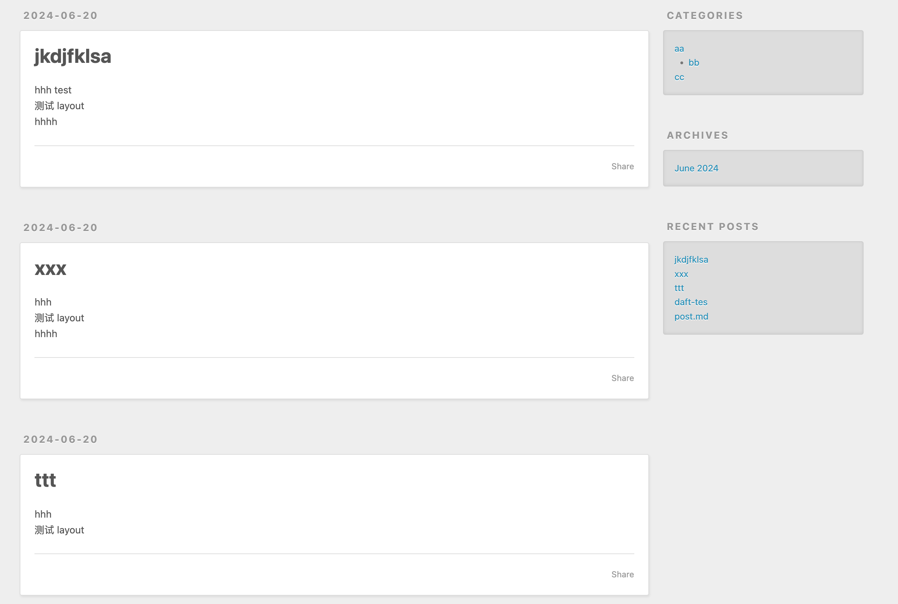

tags:: [[Hexo]]
---

- ## 安装与初始化
	- 安装 Git 与 Node.js .
	  logseq.order-list-type:: number
	- 执行如下命名初始化一个 Hexo 项目 .
	  logseq.order-list-type:: number
		- ``` sh
		  # 全局安装 hexo-cli
		  npm install hexo-cli -g
		  # 初始化一个新的 Hexo 项目
		  hexo init 存放Hexo项目的目录
		  cd 存放Hexo项目的目录
		  npm install
		  # 启动 Hexo 服务
		  hexo server
		  ```
	- 访问 `http://localhost:4000` 即可访问我们初始化的 Hexo 网站 .
	  logseq.order-list-type:: number
- ## 目录结构
	- 初始化后，目录结构如下:
		- ``` sh
		  .
		  ├── _config.landscape.yml
		  ├── _config.yml
		  ├── node_modules
		  │   ├── @adobe
		  │   ├── @tootallnate
		  │   ├── ...
		  │   ...
		  ├── package-lock.json
		  ├── package.json
		  ├── scaffolds
		  │   ├── draft.md
		  │   ├── page.md
		  │   └── post.md
		  ├── source
		  │   └── _posts
		  └── themes
		  ```
	- `node_modules` 、 `package-lock.json` 和 `package.json` 是依赖相关文件。
	- `_config.landscape.yml` 和 `_config.yml` 是配置相关文件。
	- `scaffolds/` 目录保存文章的模板。
	- `source/` 目录保存文章内容 , 我们网站要展示的内容都来自这个目录 .
	- `themes/` 目录保存 Hexo 主题相关文件。
- ## source 与 public
	- 名称以 `_` 开头的文件 / 目录 (除了 `_posts` 目录) 和 隐藏文件将会被忽略 ;
	- 而 Markdown 和 HTML 等可以被渲染的文件, 会被解析并放到 `public` 文件夹;
	- 其他文件会被直接拷贝过去 .
- ## Article 、Layout 、Scaffold 与 source 的关系
	- `Layout` 在官方中文文档中被翻译为 [布局](https://hexo.io/zh-cn/docs/writing.html#%E5%B8%83%E5%B1%80%EF%BC%88Layout%EF%BC%89) .
	- `Scaffold` 在官方中文文档中被翻译为 [模板](https://hexo.io/zh-cn/docs/writing.html#%E6%A8%A1%E7%89%88%EF%BC%88Scaffold%EF%BC%89) .
	- (私以为 `Layout` 和 `Scaffold` 其实表示的都是 **模板** , 只是前者表示 **模板名称** , 后者表示 **模板文件** )
	- 几个重要概念的关系:
		- Hexo 网站的内容是由若干篇 `Article` 组成的 .
		- 每篇 `Article` 都对应着一种 `Layout` , 使用 `hexo new [layout] <title>` 命令创建 `Article` 时需要指定 `Layout` .
		- 每种 `Layout` 都对应着一个位于 `scaffolds/` 目录下的同名模板文件 , 使用 `hexo new [layout] <title>` 命令创建 `Article` 时 , 会基于模板文件进行创建 .
		- 使用 `hexo new [layout] <title>` 命令创建的 `Article` , 会保存在 `source/` 目录下的指定子目录中 .
- ## 编写文章
	- 参考: [Hexo Docs - Command - new ](https://hexo.io/docs/commands#new)
	- ### Layout 的种类
		- 默认 `Layout` : `draft`、 `post` 、 `page`
		  logseq.order-list-type:: number
		- 自定义 `Layout`
		  logseq.order-list-type:: number
		- `draft` : 即 文章的草稿 (如果不做特殊操作, 不会在最终的网站中显示) .
		- `post` : 即 帖文 , 会以 *文章流* 的形式展现 .
			- 如下:
			- {:height 279, :width 413}
		- `page` :  即 页面 , 和 `post` 的区别是, `page` 不会出现在 *文章流* 中, 需要通过 url 单独访问 .
		- 自定义 `Layout` : 与 `post` 一致, 只不过是创建 `Article` 采用的模板不同 .
	- ### draft 文章
		- 执行 `hexo new draft <title>` 命令 , 将会基于 `scaffolds/draft.md` 模板 , 生成 `source/_drafts/{指定的 title}.md` 文件 .
	- ### post 文章
		- 执行 `hexo new [post] <title>` 命令 , 将会基于 `scaffolds/draft.md` 模板 , 生成 `source/_posts/{指定的 title}.md` 文件 .
		- ( `post` 是默认 **Layout** , 所以可以省略; `_config.yml` 文件中可以修改这个默认值 . )
	- ### page 文章
		- 执行 `hexo new draft <title>` 命令 , 将会基于 `scaffolds/page.md` 模板 , 将会生成 `source/_posts/{指定的 title}.md` 文件 .
	- ### 自定义文章
		- 执行 `hexo new {自定义Layout} <title>` 命令 , 将会基于 `scaffolds/{自定义Layout}.md` 模板 , 生成 `source/_posts/{指定的 title}.md` 文件 .
		-
- ## 编写文章的最佳实践
	- 执行 `hexo server` , 将项目运行起来 (接下来的编辑博客时, 刷新页面即可以实时看到效果) .
	  logseq.order-list-type:: number
	- logseq.order-list-type:: number
	-
- ## 配置
	-
- ## 从 Git 仓库拉取 Hexo 项目部署
	-
- ---
- ## 参考
	- [Hexo Docs](https://hexo.io/docs/)
	  logseq.order-list-type:: number