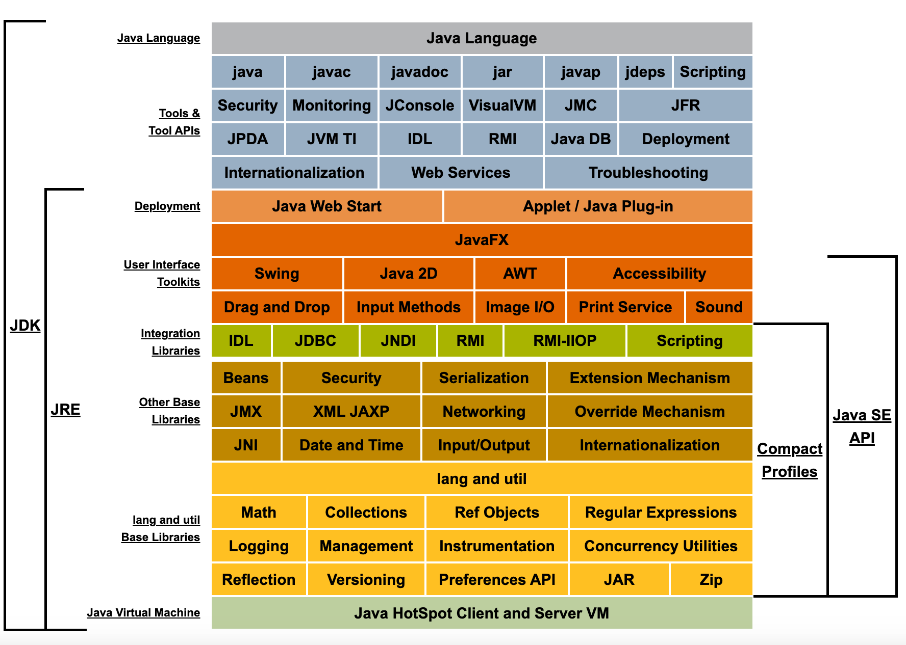

tags:: [[Java]], [[Java SE]]
---

- ==子目录==
	- [[Java SE 8/IO]]
	- [[Java SE 8/Generics]]
	- [[Java SE 8/Security]]
	- [[Java SE 8/Tools]]
- ---
- ## 学习路线
	- Java SE 8 基本概念: [[Java SE 8/Concept]]
	  logseq.order-list-type:: number
	- [[Java SE 8/Package And Import]]
	  logseq.order-list-type:: number
- ## 问题点
	- java 是如何编译项目的？Javac 参数
	  logseq.order-list-type:: number
	- Java 程序是如何读取 Jar 文件的？
	  logseq.order-list-type:: number
	- Java 命令？java -cp ？
	  logseq.order-list-type:: number
	- classpath 是啥？
	  logseq.order-list-type:: number
- ---
- ## 官方资料
	- [Java SE 8](https://docs.oracle.com/javase/8/)
		- [Java SE 8 Documentation](https://docs.oracle.com/javase/8/docs/)
		- {:height 372, :width 719}
			- [Java SE 8 Security](https://docs.oracle.com/javase/8/docs/technotes/guides/security/index.html)
		- [Java SE 8 API Specification](https://docs.oracle.com/javase/8/docs/api/index.html)
- ## 第三方资料
	- [JAVA8 官网笔记教程](https://zq99299.github.io/java-tutorial/)
	  logseq.order-list-type:: number
	- [Java™ 教程-Java Tutorials 中文版](https://pingfangx.github.io/java-tutorials/)
	  logseq.order-list-type:: number
- ---
-