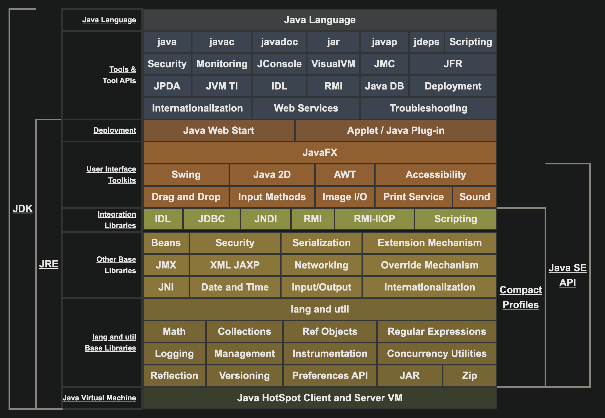

tags:: [[Java]], [[Java SE]]
---

- ==子目录==
	- [[Java SE 8/IO]]
	- [[Java SE 8/Security]]
- ---
-
- ## 官方资料
	- [Java SE 8](https://docs.oracle.com/javase/8/)
		- [Java SE 8 Documentation](https://docs.oracle.com/javase/8/docs/)
			- [Java SE 8 Security](https://docs.oracle.com/javase/8/docs/technotes/guides/security/index.html)
		- [Java SE 8 API Specification](https://docs.oracle.com/javase/8/docs/api/index.html)
- ## Java SE 8 体系结构
	- 
	- JDK (Java SE Development Kit)
	-