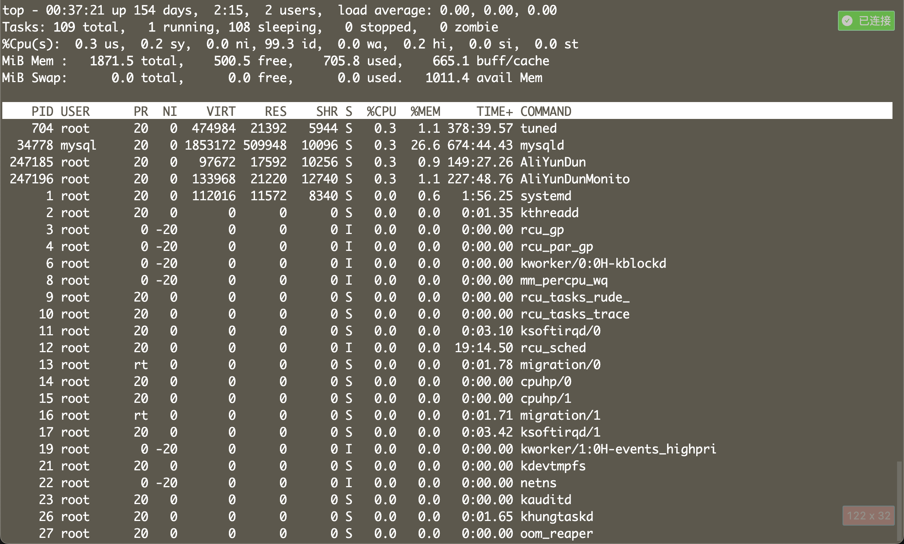
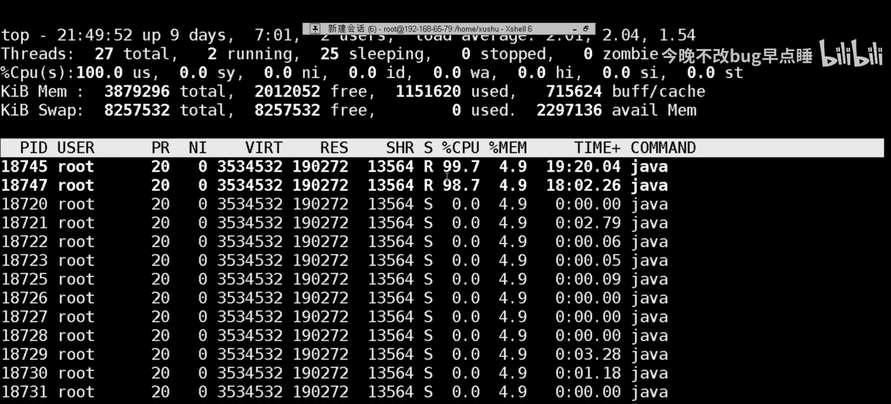
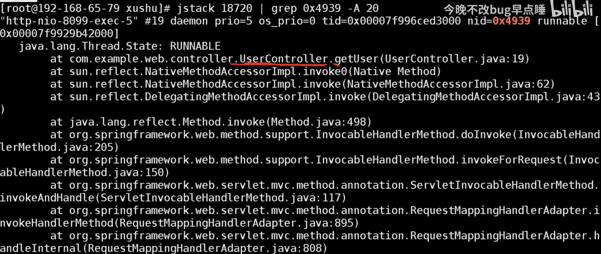
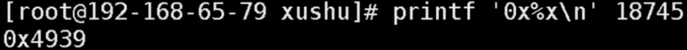

tags:: [[面试重点]], [[Java]], [[JVM]]
---

- ## 问题
	- 内存占用 暴涨/极高
	  logseq.order-list-type:: number
	- 内存溢出
	  logseq.order-list-type:: number
	- 内存泄露
	  logseq.order-list-type:: number
	- FullGC 频繁
	  logseq.order-list-type:: number
	- CPU 占用 暴涨/极高
	  logseq.order-list-type:: number
	- 进程卡死
	  logseq.order-list-type:: number
- ## 内存溢出与内存泄露
	-
- ## 内存泄露
	- 对象未正常释放，且垃圾回收器没有回收。
- ## 进程卡死
	- > 发现某个 Java 程序在打印某一条日志之后，不再继续打印，似乎程序卡死，如何排查？
- ## CPU 占用暴涨/极高
	- > 发现系统 CPU 占用暴涨/极高
	- 执行 `top` 命令：查看占用 CPU 比较高的进程。
	  logseq.order-list-type:: number
		- {:height 244, :width 787}
	- 执行 `top -Hp 进程号` 命令：查看指定进程下的 `所有线程` 占用 CPU 的情况 (PID 列为线程 ID)，找到 CPU 占用较高的线程。
	  logseq.order-list-type:: number
		- {:height 212, :width 786}
	- 执行 `jstack 进程号 | grep 线程ID` 命令：查看指定线程的状态。
	  logseq.order-list-type:: number
		- {:height 397, :width 824}
		- 这里的 `线程ID` 需要通过 `printf '0x%x\n' 线程ID` 命令转成十六进制，以为 jstack 的输出结果中是十六进制的线程 ID
		- {:height 61, :width 792}
	- 根据方法栈的信息，找到代码执行的位置，查看代码是否有问题。
	  logseq.order-list-type:: number
- ## 参考
	- [Java项目上线后，CPU突然飙高，接口卡死，如何排查解决？只需这三个命令！](https://www.bilibili.com/video/BV1uw411T7BC/?vd_source=f1fbb083ddef12dcff3388779faac201)
	  logseq.order-list-type:: number
	- [线上CPU飙升100%问题排查，一篇足矣](https://www.cnblogs.com/dennyzhangdd/p/11585971.html)
	  logseq.order-list-type:: number
	- logseq.order-list-type:: number