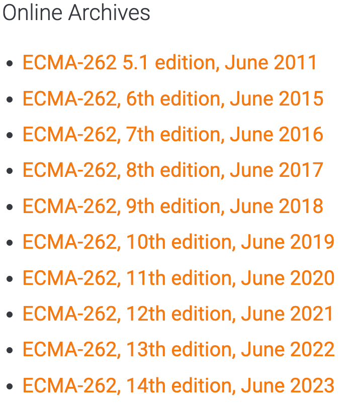

## JavaScript 与 ECMAScript
	- JavaScript 标准由 [[ECMA International]] 制定，这个标准版本的 JavaScript 被称为 ECMAScript，所以 JavaScript 是 ECMAScript 的一种实现。
	- ECMAScript 的标准由 [ECMA 的 TC39 (Technical Committee 39)](https://ecma-international.org/technical-committees/tc39) 负责维护: [TC39 官网](https://tc39.es/) 。
	- ECMAScript 标准的编号为 [ECMA-262](https://ecma-international.org/publications-and-standards/standards/ecma-262/) , 有很多版本:
		- {:height 295, :width 195}
		  id:: 66c70654-c177-43c4-b5d0-ae30fb9d7f22
		- 当前 (2024-08-22) 最新版本是: [ECMA-262, 15th edition, June 2024 ECMAScript® 2024 Language Specification](https://262.ecma-international.org/15.0/index.html) 。
- ## ES6 与 ES2015
	- 参考: [阮一峰 - ECMAScript 6 简介](https://es6.ruanyifeng.com/#docs/intro)
	- ECMAScript 2015 (ES2015) 是指 2015 年 6 月份的发布的 ECMAScript 标准，这是有史以来的第 6 个版本。
	- 由于后来每年 6 月份都会发布一个新版本，所以可以直接用年份来指代版本。
	- ES6 一般就是指 ES2015 ，但也有可能指的是 5.1 版本之后的标准，涵盖了 ES2015、ES2016、ES2017 等。
- ## 浏览器对 ECMAScript 的支持
	- [各大浏览器对 ECMAScript 的支持](https://compat-table.github.io/compat-table/es6/)
- ## Interpreted VS compiled
	- JavaScript 采用 **just-in-time compiling (即时编译)** 技术，在代码被使用时，会被编译成 binary 格式执行，以提高性能。
	- 但是，由于编译是在 **run time** 发生的 (而不是事先执行) ，所以 JavaScript 仍然被认为是 `Interpreted Language` 。
- ## Apply JavaScript
	- ### Internal JavaScript
		- 在 `<head>` 的 `<script>` 中，可以编写 JavaScript 代码:
		- ``` html
		  <!DOCTYPE html>
		  <html lang="en-US">
		  
		  <head>
		    <meta charset="utf-8">
		    <meta name="viewport" content="width=device-width">
		    <title>Apply JavaScript example</title>
		  
		    <script>
		      // JavaScript goes here
		      document.addEventListener("DOMContentLoaded", () => {
		        function createParagraph() {
		          const para = document.createElement("p");
		          para.textContent = "You clicked the button!";
		          document.body.appendChild(para);
		        }
		  
		        const buttons = document.querySelectorAll("button");
		  
		        for (const button of buttons) {
		          button.addEventListener("click", createParagraph);
		        }
		  	});
		    </script>
		  </head>
		  
		  <body>
		    <button>Click me</button>
		  </body>
		  
		  </html>
		  ```
	- ### External JavaScript
		- 使用 `<script>` 的 `src` 属性, 引入指定位置的外部 JavaScript 代码.
		- ``` html
		  <!DOCTYPE html>
		  <html lang="en-US">
		  
		  <head>
		    <meta charset="utf-8">
		    <meta name="viewport" content="width=device-width">
		    <title>Apply JavaScript example</title>
		  
		    <script src="external.js" defer></script>
		  </head>
		  
		  <body>
		    <button>Click me</button>
		  </body>
		  
		  </html>
		  ```
	- ### Inline JavaScript
		- 在元素的属性中塞入 JavaScript 代码
		- 比如下面的 `onclick 属性`
		- ``` html
		  <!DOCTYPE html>
		  <html lang="en-US">
		  
		  <head>
		    <meta charset="utf-8">
		    <meta name="viewport" content="width=device-width">
		    <title>Apply JavaScript example</title>
		  </head>
		  
		  <body>
		    <button onclick='const para = document.createElement("p");
		              para.textContent = "You clicked the button!";
		              document.body.appendChild(para);'>Click me</button>
		  </body>
		  
		  </html>
		  ```
	- ### JavaScript 加载策略
		- 上面的 `Internal JS` 将代码包裹在 `document.addEventListener("DOMContentLoaded", () => {})` 之中, 保证 JS 在 `DOMContentLoaded` event 被触发时 (即 HTML 加载和解析之后) 执行。
		- 上面的 `External JS` 使用 `defer` 保证在页面加载完成后再执行 JavaScript 代码, 这种情况下 JS 和 HTML DOM 是同时加载的。
		- `defer` 只能作用在 `External JS` , `Internal JS` 在 `<script>` 标签上使用这个无效。
		- 一个 old-fashioned 方法是将 `<script>` 放到所有 HTML 元素的后面, `</body>` 的前面:
			- 这种方法的问题是，会导致浏览器在 加载完所有 HTML DOM 之后, 才加载和解析 JS, 导致网站变慢.
- ---
- ## 参考
	- [MDN - What is JavaScript?](https://developer.mozilla.org/en-US/docs/Learn/JavaScript/First_steps/What_is_JavaScript)
	  logseq.order-list-type:: number
	- [MDN - JavaScript Introduction](https://developer.mozilla.org/en-US/docs/Web/JavaScript/Guide/Introduction)
	  logseq.order-list-type:: number
	- logseq.order-list-type:: number