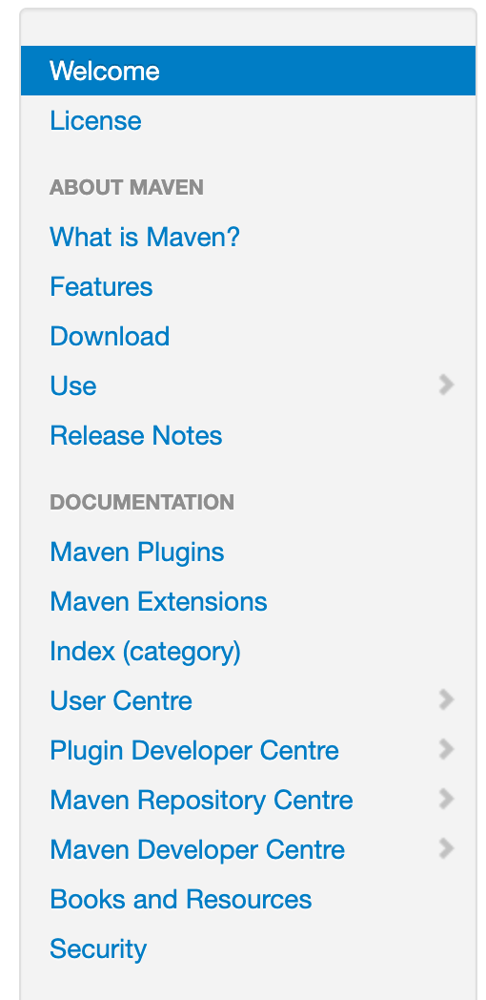

alias:: [[Apache Maven]]
tags:: [[Build Tool]], [[Package Manager]]
---

- ## 学习路线
	- [[Maven 安装]]
	  logseq.order-list-type:: number
	- [[Maven Concept]]
	  logseq.order-list-type:: number
	- [[Maven POM]]
	- [[Maven Settings]]
	- [[Maven Archetype]]
	- [[Maven Command]]
- ---
- ## 官方资料
	- ### 学习文档
		- [Maven Home Page](https://maven.apache.org/index.html)
			- [文档预览](https://maven.apache.org/guides/index.html)
	- ### References
		- [Central Repository Directory](https://repo.maven.apache.org/maven2/)
- ## 学习进度
	- 跟着导航栏的文档看先
		- {:height 481, :width 245}
		-
- ## 问题点
	- mvn spring-boot:run 为啥可以执行? ((6620bd09-1085-4f98-8ffd-4011f497fe85))
	  logseq.order-list-type:: number
	- logseq.order-list-type:: number
- ---
-
-