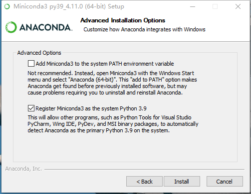

tags:: [[Miniconda]]
---

- ## 卸载 Miniconda
	- 参见: [Uninstalling Miniconda](https://www.anaconda.com/docs/getting-started/miniconda/uninstall)
- ## Windows 安装 Miniconda
	- 到此地址下载 [Miniconda Installers](https://www.anaconda.com/download/success#miniconda)。
	  logseq.order-list-type:: number
	  id:: 67e96214-a8d4-4369-bddc-b7a0c047146d
	- 双击安装，选择安装位置，到这里取消勾选两个复选框。
	  logseq.order-list-type:: number
		- 
		- 这里如果勾选了这个两个复选框，则会在系统环境变量 `path` 中加入如下几项：
			- ```sh
			   # 此项是把conda自带的python加入环境变量
			   E:\devtools\sdk\conda\miniconda4.11.0 
			   E:\devtools\sdk\conda\miniconda4.11.0\Library\mingw-w64\bin
			   E:\devtools\sdk\conda\miniconda4.11.0\Library\usr\bin
			   E:\devtools\sdk\conda\miniconda4.11.0\Library\bin
			   # 此项可以把conda加入环境变量
			   E:\devtools\sdk\conda\miniconda4.11.0\Scripts 
			  ```
		- 如果不加此项：`E:\devtools\sdk\conda\miniconda4.11.0\Library\bin` ，则下载依赖包时，会报如下的错误。
			- ```sh
			  PS E:\codes\python\start\EIN-SELD> conda env create -f environment.yml
			  Collecting package metadata (repodata.json): failed
			  - CondaHTTPError: HTTP 000 CONNECTION FAILED for url <https://conda.anaconda.org/pytorch/win-64/repodata.json>
			  Elapsed: -
			  - An HTTP error occurred when trying to retrieve this URL.
			  HTTP errors are often intermittent, and a simple retry will get you on your way.
			  'https://conda.anaconda.org/pytorch/win-64'
			  ```
			- 因为下载依赖包时，需要用到此目录中的 `libcrypto-1_1-x64.dll` 和 `libssl-1_1-x64.dll` 两个文件；如果不加此项，需要将这两个文件复制进 `\DLLs` 目录中。
	- 添加环境变量.
	  logseq.order-list-type:: number
		- ```properties
		  # 新增 CONDA_HOME 
		  CONDA_HOME = E:\devtools\sdk\conda\miniconda4.11.0
		  
		  # 在 Path 中新增如下几项：
		  %CONDA_HOME%\Scripts;%CONDA_HOME%\Library\bin;%CONDA_HOME%\Library\mingw-w64\bin;%CONDA_HOME%\Library\usr\bin
		  ```
- ## 安装问题
	- 参见: [[Anaconda 与 Miniconda 安装疑难杂症]]
- ## 配置 Conda Channel
	- 参见: [[Conda Channel]]
-