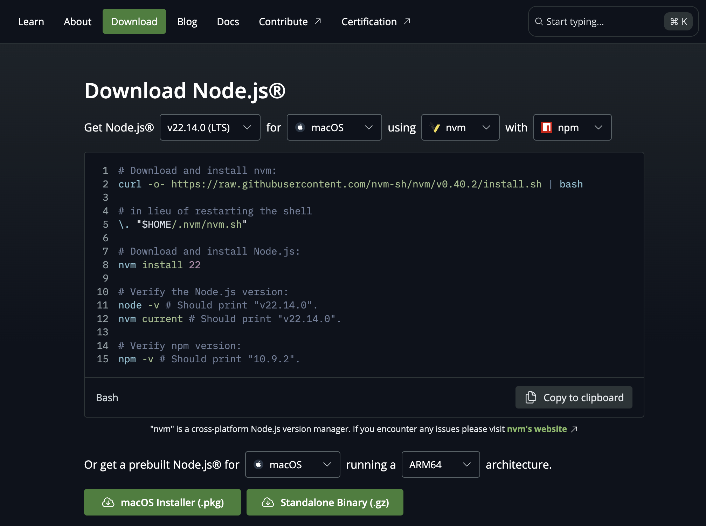

tags:: [[Node.js]]
---

- ## 安装 Node.js
	- 参见: [Download Node.js](https://nodejs.org/en/download)
	- 
	- 官方提供了两种安装方式:
		- 使用命令行安装.
		  logseq.order-list-type:: number
			- 建议使用 `nvm` 安装, 包管理工具选择 `npm` .
		- 使用安装包安装
		  logseq.order-list-type:: number
			- 无脑下一步（安装程序会自动添加环境变量，如 `D:\dev\tools\nodejs\` ）。
	- 如何验证是否安装成功:
		- 命令行执行 `node -v` , `npm -v` 和 `npx -v` 能输出版本即表示安装成功。
- ## Homebrew 与 nvm
	- ### 存在的问题
		- Homebrew 与 nvm 安装的 Node.js 被放在不同目录下, 内置的 npm 也在不同目录下, npm 下载的包也在不同目录下.
		- 所以可能存在如下问题:
			- 先使用 Homebrew 安装了 Node.js , 并使用其内置 npm 安装过软件;
			- 后面又使用 nvm 安装了 Node.js ,并使用其内置 npm 安装过软件;
			- 由于 Path 变量优先级的原因, 可能全局使用的 Node.js 是 nvm 安装的, 但全局使用的软件, 可能是 Homebrew 安装的 npm 安装的.
	- ### Homebrew 安装的 Node.js
		- 首先, Node.js 被安装在 `/opt/homebrew/Cellar/node/23.10.0_1` .
			- ``` zsh
			  ➜  23.10.0_1 git:(stable) ll
			  total 504
			  -rw-r--r--@ 1 vincent  admin    53K Mar 13 18:53 CHANGELOG.md
			  -rw-r--r--@ 1 vincent  admin   2.0K Mar 25 02:27 INSTALL_RECEIPT.json
			  -rw-r--r--@ 1 vincent  admin   139K Mar 13 18:53 LICENSE
			  -rw-r--r--@ 1 vincent  admin    39K Mar 13 18:53 README.md
			  drwxr-xr-x@ 6 vincent  admin   192B Mar 25 02:27 bin
			  drwxr-xr-x@ 3 vincent  admin    96B Mar 13 18:53 etc
			  drwxr-xr-x@ 3 vincent  admin    96B Mar 13 18:53 include
			  drwxr-xr-x@ 3 vincent  admin    96B Mar 13 18:53 lib
			  drwxr-xr-x@ 4 vincent  admin   128B Mar 13 18:53 libexec
			  -rw-r--r--@ 1 vincent  admin   9.3K Mar 25 02:27 sbom.spdx.json
			  drwxr-xr-x@ 4 vincent  admin   128B Mar 13 18:53 share
			  ```
		- 在 `/opt/homebrew/Cellar/node/23.10.0_1/bin` 目录中, 有 `npm` , `npx` 等命令, 指向 `/opt/homebrew/lib/node_modules` 目录下的内容.
		  logseq.order-list-type:: number
			- ``` zsh
			  ➜  bin git:(stable) ll
			  total 120784
			  lrwxr-xr-x@ 1 vincent  admin    45B Mar 13 18:53 corepack -> ../lib/node_modules/corepack/dist/corepack.js
			  -r-xr-xr-x@ 1 vincent  admin    59M Mar 25 02:27 node
			  lrwxr-xr-x@ 1 vincent  admin    49B Mar 25 02:27 npm -> /opt/homebrew/lib/node_modules/npm/bin/npm-cli.js
			  lrwxr-xr-x@ 1 vincent  admin    49B Mar 25 02:27 npx -> /opt/homebrew/lib/node_modules/npm/bin/npx-cli.js
			  ```
		- `/opt/homebrew/lib/node_modules` 目录下, 安装了 `npm` 安装的各个包.
		  logseq.order-list-type:: number
			- ``` zsh
			  ➜  node_modules git:(stable) ll
			  total 0
			  drwxr-xr-x   3 vincent  admin    96B Mar 19 14:49 @microsoft
			  drwxr-xr-x@  7 vincent  admin   224B Sep 13  2024 chrome-types
			  drwxr-xr-x@  8 vincent  admin   256B Mar 25 02:27 corepack
			  drwxr-xr-x   8 vincent  admin   256B Nov 21  2022 docsify
			  drwxr-xr-x  10 vincent  admin   320B Nov 21  2022 docsify-cli
			  drwxr-xr-x  10 vincent  admin   320B Jun 17  2024 hexo-cli
			  drwxr-xr-x@ 12 vincent  admin   384B Mar 25 02:27 npm
			  drwxr-xr-x@  7 vincent  admin   224B Mar 25 00:04 nrm
			  drwxr-xr-x   7 vincent  admin   224B Mar 19 14:49 pnpm
			  drwxr-xr-x  24 vincent  admin   768B Nov 28  2022 redis-commander
			  drwxr-xr-x   9 vincent  admin   288B Mar 28  2023 typescript
			  drwxr-xr-x   7 vincent  admin   224B Mar 28  2023 typescript-language-server
			  drwxr-xr-x@ 10 vincent  admin   320B Mar 25 00:33 yrm
			  ```
		- `/opt/homebrew/bin` 目录中:
		  logseq.order-list-type:: number
			- 有链接到 `/opt/homebrew/lib/node_modules` 目录下的 [[Symlink]] .
			- ``` zsh
			  ➜  bin git:(stable) ll /opt/homebrew/bin | grep 'node_modules'
			  lrwxr-xr-x  1 vincent  admin    43B Nov 21  2022 docsify -> ../lib/node_modules/docsify-cli/bin/docsify
			  lrwxr-xr-x  1 vincent  admin    37B Jun 17  2024 hexo -> ../lib/node_modules/hexo-cli/bin/hexo
			  lrwxr-xr-x@ 1 vincent  admin    37B Mar 25 00:04 nrm -> ../lib/node_modules/nrm/dist/index.js
			  lrwxr-xr-x  1 vincent  admin    37B Mar 19 14:49 pnpm -> ../lib/node_modules/pnpm/bin/pnpm.cjs
			  lrwxr-xr-x  1 vincent  admin    37B Mar 19 14:49 pnpx -> ../lib/node_modules/pnpm/bin/pnpx.cjs
			  lrwxr-xr-x  1 vincent  admin    58B Nov 28  2022 redis-commander -> ../lib/node_modules/redis-commander/bin/redis-commander.js
			  lrwxr-xr-x  1 vincent  admin    44B Mar 19 14:49 rush -> ../lib/node_modules/@microsoft/rush/bin/rush
			  lrwxr-xr-x  1 vincent  admin    49B Mar 19 14:49 rush-pnpm -> ../lib/node_modules/@microsoft/rush/bin/rush-pnpm
			  lrwxr-xr-x  1 vincent  admin    45B Mar 19 14:49 rushx -> ../lib/node_modules/@microsoft/rush/bin/rushx
			  lrwxr-xr-x  1 vincent  admin    38B Mar 28  2023 tsc -> ../lib/node_modules/typescript/bin/tsc
			  lrwxr-xr-x  1 vincent  admin    43B Mar 28  2023 tsserver -> ../lib/node_modules/typescript/bin/tsserver
			  lrwxr-xr-x  1 vincent  admin    58B Mar 28  2023 typescript-language-server -> ../lib/node_modules/typescript-language-server/lib/cli.mjs
			  lrwxr-xr-x@ 1 vincent  admin    30B Mar 25 00:33 yrm -> ../lib/node_modules/yrm/cli.js
			  ```
			- 还有链接到 `/opt/homebrew/Cellar/node/23.10.0_1/bin` 目录下的 [[Symlink]] .
			- ``` zsh
			  ➜  bin git:(stable) ll /opt/homebrew/bin | grep '/node/'
			  lrwxr-xr-x@ 1 vincent  admin    37B Mar 25 02:27 corepack -> ../Cellar/node/23.10.0_1/bin/corepack
			  lrwxr-xr-x@ 1 vincent  admin    33B Mar 25 02:27 node -> ../Cellar/node/23.10.0_1/bin/node
			  lrwxr-xr-x@ 1 vincent  admin    43B Mar 25 02:27 npm -> /opt/homebrew/Cellar/node/23.10.0_1/bin/npm
			  lrwxr-xr-x@ 1 vincent  admin    43B Mar 25 02:27 npx -> /opt/homebrew/Cellar/node/23.10.0_1/bin/npx
			  ```
			-
		- 另外 `/opt/homebrew/opt` 目录中, 还有如下 `node` 相关 [[Symlink]] .
		  logseq.order-list-type:: number
			- ``` zsh
			  ➜  opt git:(stable) ll /opt/homebrew/opt | grep 'node'
			  lrwxr-xr-x@ 1 vincent  admin    24B Mar 25 02:27 node -> ../Cellar/node/23.10.0_1
			  lrwxr-xr-x@ 1 vincent  admin    24B Mar 25 02:27 node.js -> ../Cellar/node/23.10.0_1
			  lrwxr-xr-x@ 1 vincent  admin    24B Mar 25 02:27 node@23 -> ../Cellar/node/23.10.0_1
			  lrwxr-xr-x@ 1 vincent  admin    24B Mar 25 02:27 nodejs -> ../Cellar/node/23.10.0_1
			  lrwxr-xr-x@ 1 vincent  admin    24B Mar 25 02:27 npm -> ../Cellar/node/23.10.0_1
			  ```
			- 还有可能存在 `yarn` :
				- ``` zsh
				  lrwxr-xr-x@ 1 vincent  admin    22B Feb 12 15:56 yarn -> ../Cellar/yarn/1.22.22
				  ```
	- ### 如何卸载 Homebrew 安装的相关内容
		- 先将 `~/.zshrc` 文件中, 关于 `nvm` 的环境变量注释掉, 并执行 `source ~/.zshrc` , 以防与 Homebrew 安装的 Node.js 冲突.
		  logseq.order-list-type:: number
			- ``` zsh
			  #export NVM_DIR="$HOME/.nvm"
			  #[ -s "$NVM_DIR/nvm.sh" ] && \. "$NVM_DIR/nvm.sh"  # This loads nvm
			  #[ -s "$NVM_DIR/bash_completion" ] && \. "$NVM_DIR/bash_completion"  # This loads nvm bash_completion
			  ```
		- logseq.order-list-type:: number
- ## Windows 修改全局模块下载路径
	- 参考: [Nodejs安装教程](https://blog.csdn.net/qq_48485223/article/details/122709354)
	- ### 修改路径
		- 安装后目录结构如下：
			- {:height 249, :width 622}
		- 在此目录下新建 `node_global` 和 `node_cache` 目录。
		  logseq.order-list-type:: number
		- 执行 `npm config set prefix "D:\dev\tools\nodejs\node_global"` 和 `npm config set cache "D:\dev\tools\nodejs\node_cache"` ，体现在 `%HOMEPATH%\.npmrc` 配置文件中。
		  logseq.order-list-type:: number
		- 将 **用户环境变量** 中的 `C:\Users\Vince\AppData\Roaming\npm` 改为 `D:\dev\tools\nodejs\node_global` ，并在  **系统环境变量** 中加上  `D:\dev\tools\nodejs\node_global` 。
		  logseq.order-list-type:: number
		- 新建 **系统环境变量** `NODE_PATH` ，值为 `D:\dev\tools\nodejs\node_modules` 。
		  logseq.order-list-type:: number
	- ###  设置文件夹权限
		- 为了验证上一步是否配置成功，我们可以执行 `npm install express -g` ，若报如下错误，则需要设置文件夹权限。
		- ```sh
		  C:\Users\Vince>npm install express -g
		  npm WARN config global `--global`, `--local` are deprecated. Use `--location=global` instead.
		  npm WARN logfile could not create logs-dir: Error: EPERM: operation not permitted, mkdir 'D:\dev\tools\nodejs\node_cache\_logs'
		  npm WARN logfile could not be created: Error: ENOENT: no such file or directory, open 'D:\dev\tools\nodejs\node_cache\_logs\2022-06-26T17_20_32_564Z-debug-0.log'
		  npm WARN config global `--global`, `--local` are deprecated. Use `--location=global` instead.
		  npm WARN logfile could not create logs-dir: Error: EPERM: operation not permitted, mkdir 'D:\dev\tools\nodejs\node_cache\_logs'
		  npm WARN logfile could not be created: Error: ENOENT: no such file or directory, open 'D:\dev\tools\nodejs\node_cache\_logs\2022-06-26T17_20_32_796Z-debug-0.log'
		  npm ERR! code EPERM
		  npm ERR! syscall mkdir
		  npm ERR! path D:\dev\tools\nodejs\node_cache\_cacache
		  npm ERR! errno -4048
		  npm ERR! Error: EPERM: operation not permitted, mkdir 'D:\dev\tools\nodejs\node_cache\_cacache'
		  npm ERR!  [Error: EPERM: operation not permitted, mkdir 'D:\dev\tools\nodejs\node_cache\_cacache'] {
		  npm ERR!   errno: -4048,
		  npm ERR!   code: 'EPERM',
		  npm ERR!   syscall: 'mkdir',
		  npm ERR!   path: 'D:\\dev\\tools\\nodejs\\node_cache\\_cacache'
		  npm ERR! }
		  npm ERR!
		  npm ERR! The operation was rejected by your operating system.
		  npm ERR! It's possible that the file was already in use (by a text editor or antivirus),
		  npm ERR! or that you lack permissions to access it.
		  npm ERR!
		  npm ERR! If you believe this might be a permissions issue, please double-check the
		  npm ERR! permissions of the file and its containing directories, or try running
		  npm ERR! the command again as root/Administrator.
		  - npm ERR! Log files were not written due to an error writing to the directory: D:\dev\tools\nodejs\node_cache\_logs
		  npm ERR! You can rerun the command with `--loglevel=verbose` to see the logs in your terminal
		  ```
		- 我们右击 `Node.js` 的安装目录，点击 `属性` ，再点击 `安全` ，发现文件夹权限给的不够。
			- 
		- 所有用户都给到 `完全控制` ，再次执行安装时，发现可以安装成功。
			- 
- ## 配置 npm
	- 参见: [[npm 安装与配置]]
	-