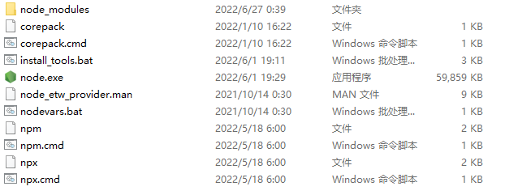
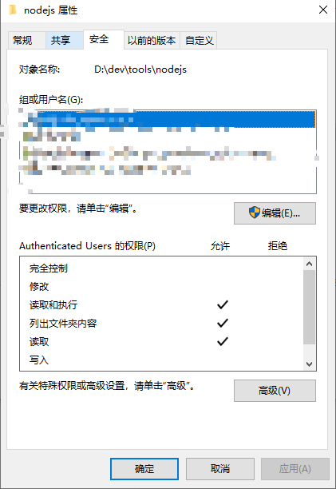
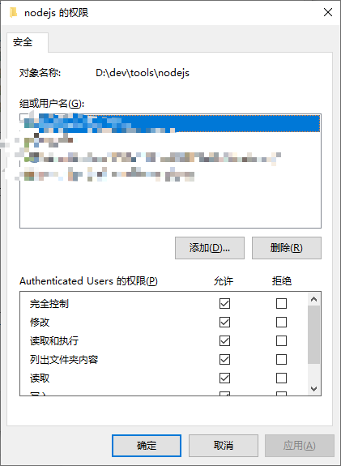

## 安装 Node.js
	- ### 使用安装包安装
		- [使用安装包安装 Node.js](https://nodejs.org/en/download/prebuilt-installer)
		- 无脑下一步（安装程序会自动添加环境变量，如 `D:\dev\tools\nodejs\` ）。
		  logseq.order-list-type:: number
		- 命令行执行 `node -v` 、 `npm -v` 和 `npx -v` 能输出版本即表示安装成功。
		  logseq.order-list-type:: number
	- ### 使用 nvm 安装
		- [使用 nvm 安装 Node.js](https://nodejs.org/en/download/package-manager)
- ## 修改全局模块下载路径
	- 安装后目录结构如下：
		- {:height 249, :width 622}
	- 在此目录下新建 `node_global` 和 `node_cache` 目录。
	  logseq.order-list-type:: number
	- 执行 `npm config set prefix "D:\dev\tools\nodejs\node_global"` 和 `npm config set cache "D:\dev\tools\nodejs\node_cache"` ，体现在 `%HOMEPATH%\.npmrc` 配置文件中。
	  logseq.order-list-type:: number
	- 将 **用户环境变量** 中的 `C:\Users\Vince\AppData\Roaming\npm` 改为 `D:\dev\tools\nodejs\node_global` ，并在  **系统环境变量** 中加上  `D:\dev\tools\nodejs\node_global` 。
	  logseq.order-list-type:: number
	- 新建 **系统环境变量** `NODE_PATH` ，值为 `D:\dev\tools\nodejs\node_modules` 。
	  logseq.order-list-type:: number
- ## 设置文件夹权限
	- 为了验证上一步是否配置成功，我们可以执行 `npm install express -g` ，若报如下错误，则需要设置文件夹权限。
	- ```sh
	  C:\Users\Vince>npm install express -g
	  npm WARN config global `--global`, `--local` are deprecated. Use `--location=global` instead.
	  npm WARN logfile could not create logs-dir: Error: EPERM: operation not permitted, mkdir 'D:\dev\tools\nodejs\node_cache\_logs'
	  npm WARN logfile could not be created: Error: ENOENT: no such file or directory, open 'D:\dev\tools\nodejs\node_cache\_logs\2022-06-26T17_20_32_564Z-debug-0.log'
	  npm WARN config global `--global`, `--local` are deprecated. Use `--location=global` instead.
	  npm WARN logfile could not create logs-dir: Error: EPERM: operation not permitted, mkdir 'D:\dev\tools\nodejs\node_cache\_logs'
	  npm WARN logfile could not be created: Error: ENOENT: no such file or directory, open 'D:\dev\tools\nodejs\node_cache\_logs\2022-06-26T17_20_32_796Z-debug-0.log'
	  npm ERR! code EPERM
	  npm ERR! syscall mkdir
	  npm ERR! path D:\dev\tools\nodejs\node_cache\_cacache
	  npm ERR! errno -4048
	  npm ERR! Error: EPERM: operation not permitted, mkdir 'D:\dev\tools\nodejs\node_cache\_cacache'
	  npm ERR!  [Error: EPERM: operation not permitted, mkdir 'D:\dev\tools\nodejs\node_cache\_cacache'] {
	  npm ERR!   errno: -4048,
	  npm ERR!   code: 'EPERM',
	  npm ERR!   syscall: 'mkdir',
	  npm ERR!   path: 'D:\\dev\\tools\\nodejs\\node_cache\\_cacache'
	  npm ERR! }
	  npm ERR!
	  npm ERR! The operation was rejected by your operating system.
	  npm ERR! It's possible that the file was already in use (by a text editor or antivirus),
	  npm ERR! or that you lack permissions to access it.
	  npm ERR!
	  npm ERR! If you believe this might be a permissions issue, please double-check the
	  npm ERR! permissions of the file and its containing directories, or try running
	  npm ERR! the command again as root/Administrator.
	  - npm ERR! Log files were not written due to an error writing to the directory: D:\dev\tools\nodejs\node_cache\_logs
	  npm ERR! You can rerun the command with `--loglevel=verbose` to see the logs in your terminal
	  ```
	- 我们右击 `Node.js` 的安装目录，点击 `属性` ，再点击 `安全` ，发现文件夹权限给的不够。
		- 
	- 所有用户都给到 `完全控制` ，再次执行安装时，发现可以安装成功。
		- 
- ## 安装 yarn
	- 参考: [yarn Installation](https://yarnpkg.com/getting-started/install#nodejs-1610)
	- 我们可以使用 `Corepack` 来管理 yarn 。
	- 执行 `corepack enable` 即可开启 `corepack`  ，执行 `yarn -v` 查看版本。
- ## 配置 npm 镜像
	- ### 方法一
		- 执行 `npm config set registry https://registry.npmmirror.com` 。
		  logseq.order-list-type:: number
		- 执行 `npm config get registry` 进行查看。
		  logseq.order-list-type:: number
	- ### 方法二
		- 执行 `npm i -g nrm` 安装镜像的管理工具 `nrm` 。
		  logseq.order-list-type:: number
		- 执行 `nrm ls` 查看所有源：
		  logseq.order-list-type:: number
			- ```sh
			  C:\Users\Vince>nrm ls
			  npm ---------- https://registry.npmjs.org/
			  yarn --------- https://registry.yarnpkg.com/
			  tencent ------ https://mirrors.cloud.tencent.com/npm/
			  cnpm --------- https://r.cnpmjs.org/
			  taobao ------- https://registry.npmmirror.com/
			  npmMirror ---- https://skimdb.npmjs.com/registry/
			  ```
		- 执行 `nrm use taobao` 即可使用淘宝的源，打开 `Node.js` 的配置文件 `%HOMEPATH%\.npmrc` 可以看到它修改了 `registry` 配置。
		  logseq.order-list-type:: number
- ## 配置 yarn 镜像
	- 执行 `npm i -g yrm` 安装镜像的管理工具 `yrm` 。
	  logseq.order-list-type:: number
	- 执行 `yrm ls` 查看所有源：
	  logseq.order-list-type:: number
		- ```sh
		  C:\Users\Vince>yrm ls
		  npm ---- https://registry.npmjs.org/
		  cnpm --- http://r.cnpmjs.org/
		  taobao - https://registry.npm.taobao.org/
		  nj ----- https://registry.nodejitsu.com/
		  rednpm - http://registry.mirror.cqupt.edu.cn/
		  npmMirror  https://skimdb.npmjs.com/registry/
		  edunpm - http://registry.enpmjs.org/
		  yarn --- https://registry.yarnpkg.com
		  ```
	- 执行 `yrm use taobao` 即可使用淘宝的源，打开 `Node.js` 的配置文件 `%HOMEPATH%\.npmrc` 可以看到它修改了 `registry` 配置。
	  logseq.order-list-type:: number
- ---
- ## 参考
	- [Nodejs安装教程](https://blog.csdn.net/qq_48485223/article/details/122709354)
	  logseq.order-list-type:: number
	-