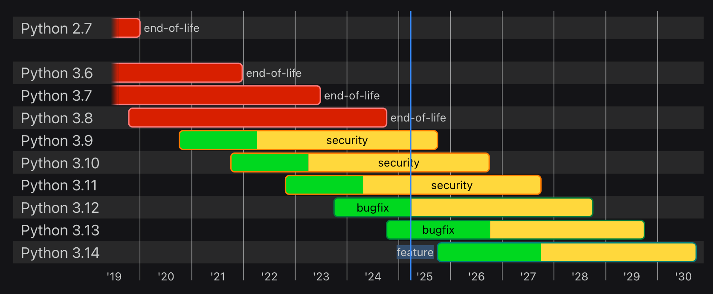
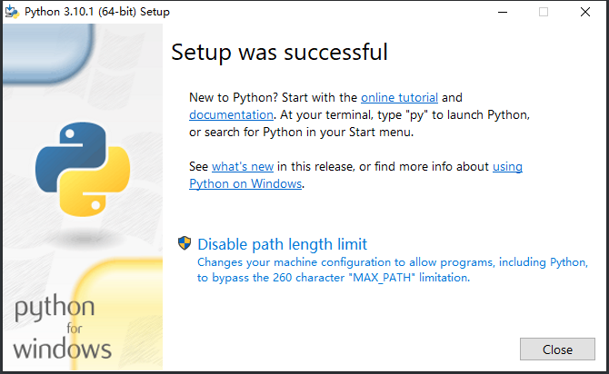

tags:: [[Python]]
---

- ## Python 版本
	- 参见: [Python Developers Guide- Status of Python versions](https://devguide.python.org/versions)
	- ### Python 版本号
		- Python 2.x 已成为历史, 现在用 Python 3.x .
		- Python 3.x  版本号格式为 Python 3.x.y .
			- 3.x 表示一个大版本, 每个大版本都有完整的生命周期;
			- 其生命周期期间, 会有小版本 y 的发布.
	- ### Python 版本生命周期
		- Python 各版本当前所处阶段 (截图于 2025-03-30 )
			- {:height 365, :width 757}
		- `feature` : 新增功能阶段.
			- 在发布第一个 beta 版本之前, 它一直可以接受 `new features` , `bug fixes` 和 `security fixes` .
		- `prerelease` : 预发布阶段.
			- 在发布第一个 beta 版本之后, 它不再接受 `new features` , 但接受 `feature fixes` (可能包含对新功能的重大修改) , `bug fixes` 和 `security fixes` .
		- `bugfix` : Bug 修复阶段.
			- 仅接受 `bug fixes` 和 `security fixes` .
		- `security` : 安全修复阶段.
			- 仅接受 `security fixes` .
		- `end-of-life` : 生命终止.
			- 不再更改.
- ## 使用安装
- ## Windows 使用安装包安装 Python (不推荐)
	- 1. 安装 Python，自定义安装路径，一路 next（最后点击 `Disable Path length limit` ）。
		- 
	- 2. 配置环境变量 (安装时如果勾选了自动配置环境变量, 则不用手动设置, ==但建议手动设置== )。
		- `path` 环境变量加上 Python 的安装路径。
- ## 验证是否安装成功
	- ``` zsh
	  # 注意 -V 是大写
	  python3 -V
	  pip3 -V
	  ```
- ## 设置 pip registry
	- 参见: [[pip Registry]]
-