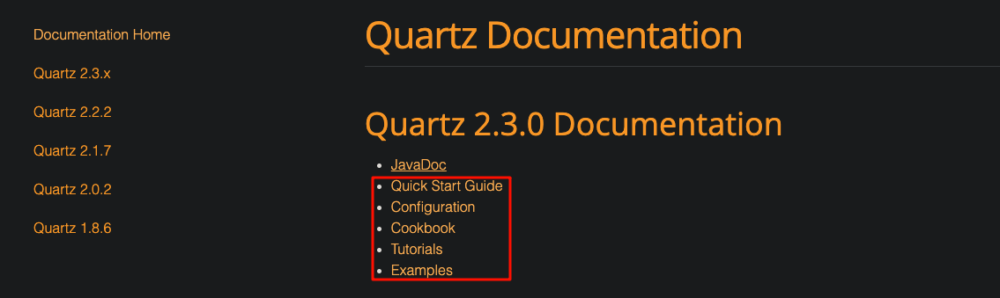

tags:: [[Scheduling Library]]
---

- ==以 Quartz 2.3.0 为主==
- ## 问题
	- Quartz 与 Terracotta 关系？
	  logseq.order-list-type:: number
		- `Terracotta` 原意为 `陶土` 。
		  logseq.order-list-type:: number
		- `Terracotta`  貌似是用来持久化的？
		  logseq.order-list-type:: number
	- quartz-jobs-2.3.0-SNAPSHOT.jar 与 quartz-2.3.0-SNAPSHOT.jar？
	  logseq.order-list-type:: number
	- SchedulerFactory 的原理。
	  logseq.order-list-type:: number
		- 读取配置文件
	- Job 与 JobDetail 的关系？
	  logseq.order-list-type:: number
	- Scheduler、Job 、JobDetail 和 Trigger 的关系？
	  logseq.order-list-type:: number
		- 一个 Job 可以绑定很多Trigger，但 一个 Trigger 只能绑定到一个 Job?
		  logseq.order-list-type:: number
		- 一个 Job 可以绑定到多个 JobDetail 吗？
		  logseq.order-list-type:: number
	- 底层原理
	  logseq.order-list-type:: number
		- `org.quartz.core.QuartzSchedulerThread`
		  logseq.order-list-type:: number
		- `org.quartz.spi.JobStore`
		  logseq.order-list-type:: number
		- `org.quartz.spi.ThreadPool`
		  logseq.order-list-type:: number
		- `org.quartz.core.JobRunShell`
		  logseq.order-list-type:: number
- ## 学习路线
	- [[Quartz Concept]]
	  logseq.order-list-type:: number
	- [[Quartz Job and JobDetail]]
	  logseq.order-list-type:: number
	- [[Quartz SchedulerFactory and Scheduler]]
	  logseq.order-list-type:: number
	- [[Quartz Trigger]]
	  logseq.order-list-type:: number
	- [[Quartz Examples]]
	  logseq.order-list-type:: number
- ## 学习进度
	- [Quartz 2.3.0 Documentation](https://www.quartz-scheduler.org/documentation/quartz-2.3.0/)
	- {:height 240, :width 696}
	- 学习顺序：
		- ~~Quick Start Guide~~ 看完
		  logseq.order-list-type:: number
		- Tutorials
		  logseq.order-list-type:: number
			- 接下来看  Lesson 3 的 Other Attributes Of Jobs
		- Examples
		  logseq.order-list-type:: number
		- Cookbook (一些 How-to)
		  logseq.order-list-type:: number
		- Configuration 和 JavaDoc 需要时查阅。
		  logseq.order-list-type:: number
- ## 官方资料
	- [Quartz Home Page](https://www.quartz-scheduler.org/)
	- ### References
		- 配置: [Configuration Reference](https://www.quartz-scheduler.org/documentation/quartz-2.3.0/configuration/)
		  logseq.order-list-type:: number
		- logseq.order-list-type:: number
-