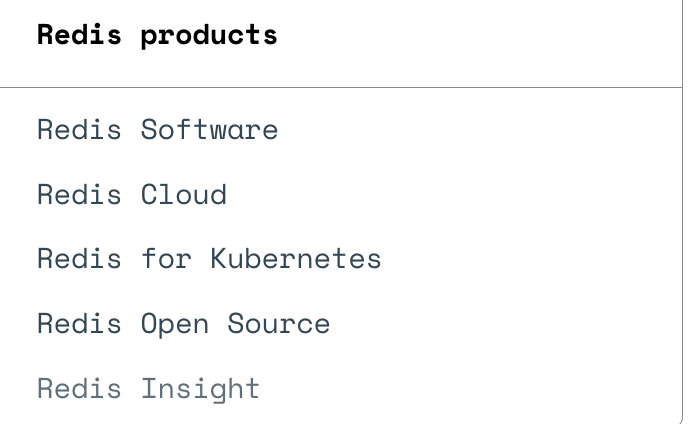
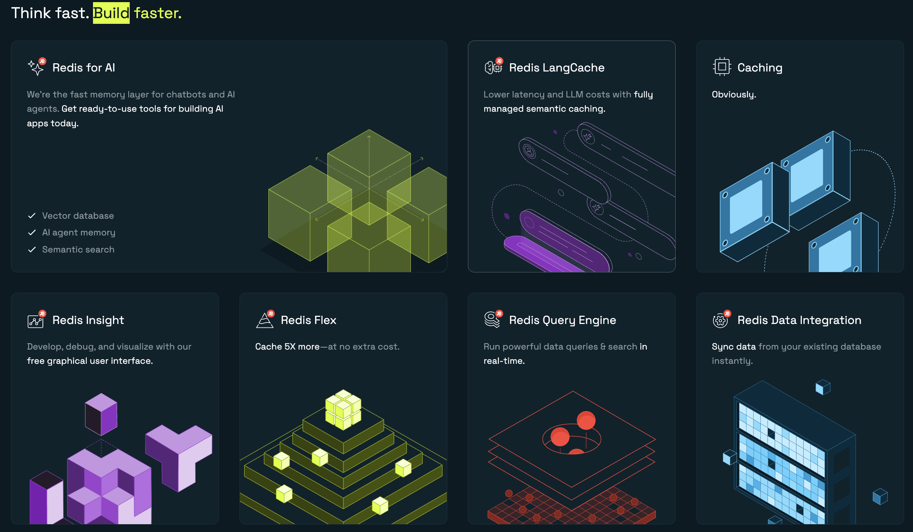

tags:: [[Redis]]
---

- ## Redis 产品
	- ### Redis 产品概览
		- [Redis products](https://redis.io/docs/latest/operate/)
			- {:height 158, :width 314}
		- [Redis 官网首页](https://redis.io/)
			- {:height 481, :width 809}
	- ### Redis 本身
		- #### Redis Open Source 与 Redis Enterprise Software
			- `Redis Open Source` (旧称: `Redis Community Edition` )
				- 即 Redis 开源版本.
			- `Redis Enterprise Software` / `Redis Software`
				- 即 Redis 企业版本.
			- 二者区别 (DeepSeek 总结) :
				- | **维度** | **Redis Open Source** | **Redis Enterprise Software** |
				  | ---- | ---- | ---- |
				  | 核心功能 | 基础缓存与数据结构 | 企业级扩展功能（集群、安全、模块等） |
				  | 许可类型 | 源代码可用（SSPLv1 + RSALv2） | 商业闭源许可 |
				  | 成本 | 免费（云托管可能需额外费用） | 订阅制付费 |
		- #### Redis Open Source 协议变更
			- 参考: [Redis Adopts Dual Source-Available Licensing](https://redis.io/blog/redis-adopts-dual-source-available-licensing/)
			- 从 Redis 7.4 版本开始, Redis 采用 [Redis Source Available License (RSALv2)](https://redis.io/legal/rsalv2-agreement/) 和 [Server Side Public License (SSPLv1)](https://redis.io/legal/server-side-public-license-sspl/) 双协议.
			  logseq.order-list-type:: number
			- 此变更会影响谁?
			  logseq.order-list-type:: number
				- 受影响的只有: 提供 Redis 竞品 (competitive offerings) 的组织.
					- “competitive offerings” 是指源自 Redis 代码库, 与 Redis 商业产品的功能有显著重叠, 并销售给第三方的产品.
				- 因此, 托管 Redis 产品的云厂商, 将不再被允许免费使用 Redis 源代码.
				- 但, 允许在组织内部托管 Redis , 供组织内部使用.
			- Redis 7.2 及其之前的版本将被称为 `Redis OSS` , Redis 7.4 及其之后的版本将被称为 `Redis Community Edition` (后改称为 `Redis Open Source` ).
			  logseq.order-list-type:: number
	- ### Redis Modules
		- #### Redis Query Engine
			- Redis Open Source , Redis Enterprise Software 和 Redis Cloud 都具备的一个功能.
			- 用于搜索和查询 Redis 数据.
			- 需要安装 [[RediSearch]] 模块以使用此功能.
	- ### Redis Stack
		- 参考: [GitHub - Redis Stack](https://github.com/redis-stack)
		- Redis Stack 是 Redis 开源版本的扩展.
		- Redis Stack 包含如下几部分:
			- ==Redis Stack Server==
			  logseq.order-list-type:: number
				- 在 Redis 开源版本基础上, 集成了如下模块:
					- [[RediSearch]]
					- RedisJSON
					- RedisTimeSeries
					- RedisBloom
			- ==Redis Stack Clients==
			  logseq.order-list-type:: number
				- 有如下几个 Redis 客户端库, 支持 Redis Stack :
				  logseq.order-list-type:: number
					- redis-py
					- node_redis
					- NRedisStack
					- Jedis
				- 有如下几个 对象映射 (object mapping) 库, 支持 Redis Stack :
				  logseq.order-list-type:: number
					- Redis OM .NET
					- Redis OM Node
					- Redis OM Python
					- Redis OM Spring
			- ==[[Redis Insight]]==
			  logseq.order-list-type:: number
				- Redis GUI 客户端工具.
		- ==貌似, 如今 (2025.05.05) Redis 官方不怎么提 Redis Stack 这个概念, 官网没看到这个介绍.==
	- ### Redis Data Integration (RDI)
		-
	- ### Redis Cloud
		- 参考: [Redis Cloud](https://redis.io/cloud/)
		- Redis 官方提供的 Redis 云服务.
		- #### Redis Flex
			- 参考: [Redis Flex](https://redis.io/solutions/flex/)
			- Redis Flex 是 Redis Cloud 提供的服务.
			- 通过使用固态硬盘（SSD）扩展数据库, 达到使用相同价格缓存 5 倍多数据的效果.
	- ### Redis Enterprise for Kubernetes
		- 将 Redis Enterprise Software 集成到 Kubernetes 的产品.
	- ### AI 相关产品
		- [[Redis for AI]]
			- 基于 Redis 向量数据库集成的功能和服务包, 用于开发 AI 应用.
		- [[Redis LangCache]]
			- 通过 语义缓存 (semantic caching) , 降低延迟和 LLM 调用成本.