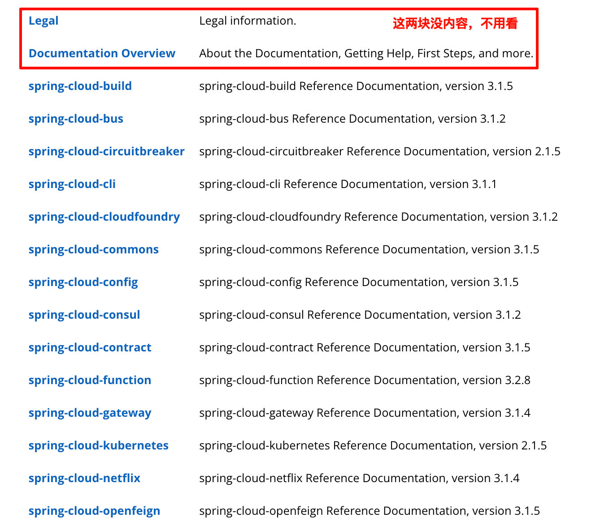

tags:: [[Spring Cloud]]
---

- ##  什么是 Spring Cloud
	- Spring Cloud 是一系列开箱即用的 **分布式系统 (Distributed System)** 常用功能的集合：
		- Service registration and discovery  - `Spring Cloud Zookeeper`
		- Routing - `Spring Cloud Gateway`
		- Service-to-service calls  - `Spring Cloud OpenFeign`
		- 等等
	- 这些功能都是一个个独立的项目，每个项目都有自己独立的发布节奏。
		- > Spring Cloud is an umbrella project consisting of independent projects with, in principle, different release cadences).
		  Spring Cloud 是一个由具有不同发布节奏的独立项目组成的伞形项目。
		  -- 引自 [Release Train Naming Convention](https://github.com/spring-cloud/spring-cloud-release/wiki/Release-Train-Naming-Convention)
- ## Spring Cloud 版本
	- ### 与 Spring Boot 相匹配的各版本
		- {:height 389, :width 594}
		- ([图片来源](https://spring.io/projects/spring-cloud))
	- ### 什么是 Spring Cloud Release Train
		- [[Release Train]] 是精心组织的 ( *curated* ) 一系列 Spring Cloud 项目依赖的集合，可以通过引入 `spring-cloud-dependencies POM` 来使用。
			- > Spring Cloud Release Train is a curated set of dependencies across a range of Spring Cloud projects. 
			  -- 引自 [spring-cloud-release github repo - README](https://github.com/spring-cloud/spring-cloud-release)
		- 这里的每个 `Release Train` 只是名称，不是具体的版本号，每个 `Release Train` 都有多个小版本。
			- 每个小版本会修复 Bug 或增加兼容旧版本的功能。
			- 每个小版本被称为 `service release (SR)` (旧版本号中有体现，如 `Hoxton.SR9` )
		- `Release Train` 的名称是伦敦地铁站名称 (London Tube Station names) ，一开始会作为版本号的一部分，后面只作为项目代号，版本号改用年份格式 (Calendar Versioning)。
			- 参考  [Release Train Naming Convention](https://github.com/spring-cloud/spring-cloud-release/wiki/Release-Train-Naming-Convention)
	- ### Spring Cloud 包含哪些依赖
		- `spring-cloud-dependencies` 和 `spring-cloud-starter-parent` (两者版本号一致，一一对应)
		  logseq.order-list-type:: number
			- `spring-cloud-dependencies` : 管理各个 Cloud 组件的版本，以保证他们之间可以兼容。
			- `spring-cloud-starter-parent` : 除了引入 `spring-cloud-dependencies` 到 `<dependencyManagement>` 中，相较 `spring-cloud-dependencies`  还增加了如下内容：
				- 参见: [spring-cloud-starter-parent/2021.0.9](https://search.maven.org/artifact/org.springframework.cloud/spring-cloud-starter-parent/2021.0.9/pom)
				- 引用与之适配的 `spring-boot-starter-parent` 作为父项目，这样就拥有了 Spring Boot 的依赖管理。
				  logseq.order-list-type:: number
				- 增加 `<distributionManagement>` 和 `<profiles>` 等配置内容。
				  logseq.order-list-type:: number
			- ==如果要快速开发 Spring  Cloud 应用，只需将 `spring-cloud-starter-parent` 作为父项目，省去引入 `spring-boot-starter-parent` 或 `spring-boot-dependencies` 。 ==
		- 各个 Cloud 组件 (版本由 `spring-cloud-dependencies` 管理)，开发时按需引入即可。
		  logseq.order-list-type:: number
			- `spring-cloud-starter-gateway`
			  logseq.order-list-type:: number
			- `spring-cloud-starter-openfeign`
			  logseq.order-list-type:: number
			- 等等
			  logseq.order-list-type:: number
- ## 引入 Spring Cloud 最佳实践
	- 先确定我们使用的 Spring Boot 的版本。
	  logseq.order-list-type:: number
	- 然后根据 Spring Boot  的版本，选择适配的 Spring Cloud 的版本。
	  logseq.order-list-type:: number
		- 如果不考虑与  Spring Cloud Alibaba 的兼容性的话，一旦确定了 Spring Boot 的版本，就可以选择使用适配的 `Release Train` 下的最新的小版本。
	- 在 `pom.xml` 文件中加入如下内容。
	  logseq.order-list-type:: number
		- ``` xml
		  <properties>
		      <spring-cloud.version>2021.0.9</spring-cloud.version>
		  </properties>
		  <dependencyManagement>
		      <dependencies>
		          <dependency>
		              <groupId>org.springframework.cloud</groupId>
		              <artifactId>spring-cloud-dependencies</artifactId>
		              <version>${spring-cloud.version}</version>
		              <type>pom</type>
		              <scope>import</scope>
		          </dependency>
		      </dependencies>
		  </dependencyManagement>
		  ```
- ## 官方文档怎么用
	- ### 查看各组件文档
		- 在相应版本的 Spring Cloud 文档中 (如 [Spring Cloud 2021.0.5 文档](https://docs.spring.io/spring-cloud/docs/2021.0.5/reference/html/) )，进入想要使用的组件即可。
		- {:height 358, :width 678}
	- ### 查看配置汇总
		- 在相应版本的 Spring Cloud 文档中 (如 [Spring Cloud 2021.0.5 文档](https://docs.spring.io/spring-cloud/docs/2021.0.5/reference/html/) )，进入配置汇总页面即可。
		- {:height 89, :width 522}
- ## 参考
	- [Spring Cloud Overview](https://spring.io/projects/spring-cloud)
	  logseq.order-list-type:: number
	- logseq.order-list-type:: number
-