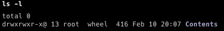

alias:: APFS, Apple File System

- tags:: macOS
-
-
- # macOS File System
	- ## 官方资料
		- Apple - [File System Basics](https://developer.apple.com/library/content/documentation/FileManagement/Conceptual/FileSystemProgrammingGuide/FileSystemOverview/FileSystemOverview.html)
		- Apple - [About Apple File System](https://developer.apple.com/documentation/foundation/file_system/about_apple_file_system)
		- Apple - [Role of Apple File System](https://support.apple.com/guide/security/role-of-apple-file-system-seca6147599e/1/web/1)
		- Apple - [Add, delete, or erase APFS Volumes in Disk Utility on Mac](https://support.apple.com/guide/disk-utility/add-erase-or-delete-apfs-volumes-dskua9e6a110/mac)
		- Apple - [About System Integrity Protection on your Mac](https://support.apple.com/HT204899)
	- ## 第三方资料
		- ### 博文
			- [Mac OS X 的系统目录结构](https://www.cnblogs.com/gujiande/p/9447006.html)
	- ## Operation not permitted
		- 参考:  [mac shell 脚本执行报错 Operation not permitted](https://segmentfault.com/a/1190000039919416)
		- 执行 `ls -l` 会发现权限后面带了一个 `@` 。
		- 
		- 从互联网上下载来的文件，会被 macOS 打上 com.apple.quarantine 标志，从而隔离文件。
		- 需要执行如下命令去除
		- ```zsh
		  sudo xattr -r -d com.apple.quarantine yourdir
		  ```
-