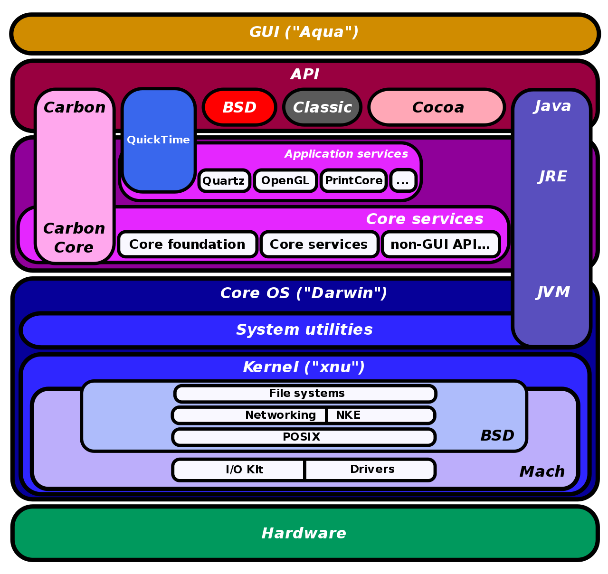

alias:: macOS history

- tags:: macOS, history
-
- # macOS 历史
	- ## 第三方资料
		- [Why is macOS often referred to as 'Darwin'?](https://apple.stackexchange.com/questions/401832/why-is-macos-often-referred-to-as-darwin)
		- [Apple 开源系统 Darwin 的历史](https://zhuanlan.zhihu.com/p/436752408)
		- [wikipedia - XNU](https://en.wikipedia.org/wiki/XNU)
		- [wikipedia - Darwin](https://en.wikipedia.org/wiki/Darwin_(operating_system))
		-
	- ## 简史
		- 1、NeXTSetp
			- 被开除的 Steve Jobs 开办了 NeXT 公司，NeXT 公司开发了 NeXTStep 系统；NeXTStep 系统基于 **将 BSD(源代码) 移植到 [[Mach]] 微内核** 。
			- 后来，NeXT 公司 将 NeXTSetp 系统的 **高层框架** 从 **底层系统** 抽离，并以 `OpenStep for 某某操作系统` 为名(如 OpenStep for Windows NT、OpenStep for Sun Solaris)，提供服务；"OpenStep for Mach" 仍然基于原 NeXTStep 相同的基础。
			-
		- 2、Apple
			- 苹果电脑的原有操作系统，从一开始就被设计成 **单用户、单任务** ，弊端很大；Apple 多次试图将操作系统 **现代化** ，但都以失败告终。
			- Apple 收购 NeXT 后，在 OpenStep for Mach 的基础上，将 Mach 内核从 2.5 升至 3 ，并使用 FreeBSD 内核中的概念对其进行了扩展，形成了新的内核 XNU ，也形成了 从 4.3 BSD 到 4.4 BSD 和 后来的 FreeBSD 的 BSD 基础。
			-
		-
		-
		- 
-
-