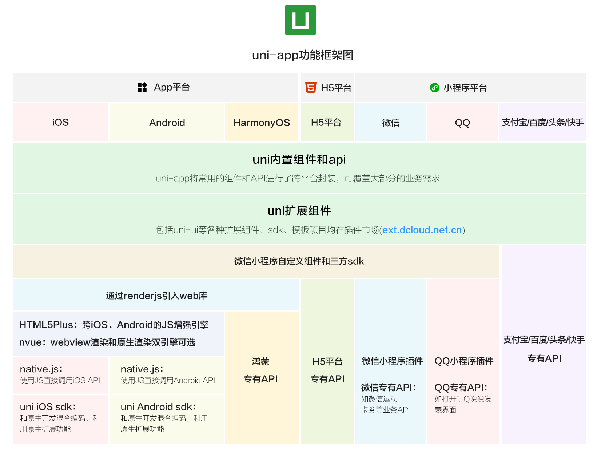

tags:: [[uni-app]]
---

- ## uni-app 是啥
	- `uni-app` 是一个使用 `Vue.js` 开发 **所有前端应用** 的框架。
	- 编写一套代码，可发布到如下多个平台：
		- iOS
		- Android
		- Web（响应式）
		- 各种小程序（微信/支付宝/百度/头条/飞书/QQ/快手/钉钉/淘宝）
		- 快应用
		- ......
- ## uni-app 功能框架
	- 
	- 图片来源: [什么是 uni-app](https://uniapp.dcloud.net.cn/#%E4%B8%BA%E4%BB%80%E4%B9%88%E8%A6%81%E9%80%89%E6%8B%A9uni-app)
-