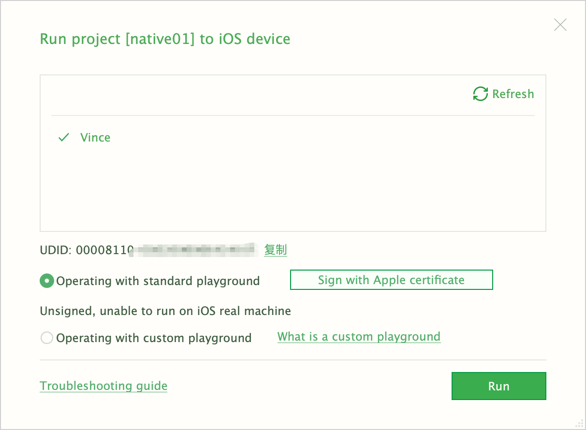
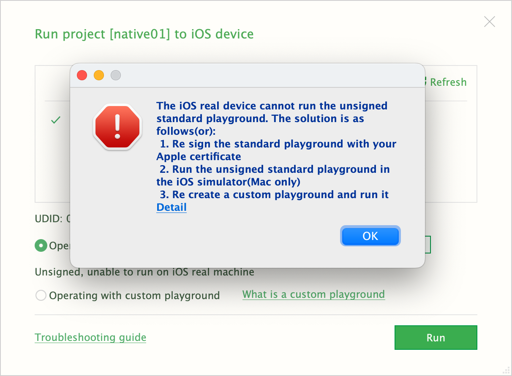

tags:: [[uni-app]]
---

- ## 未签名无法在真机运行
	- 将 iOS 设备通过数据线连接到 Mac 上.
	  logseq.order-list-type:: number
	- HbuilderX 点击 Run > Moblie App Playground > iOS Run , 可以看到我们连接到 Mac 上的设备.
	  logseq.order-list-type:: number
		- {:height 393, :width 512}
	- 选择我们的设备, 发现会有如下弹框.
	  logseq.order-list-type:: number
		- {:height 547, :width 471}
	- logseq.order-list-type:: number
- ## 参考
	- [uni-app - App 平台: 真机运行](https://uniapp.dcloud.net.cn/tutorial/run/run-app.html#ios_device)
	  logseq.order-list-type:: number
-