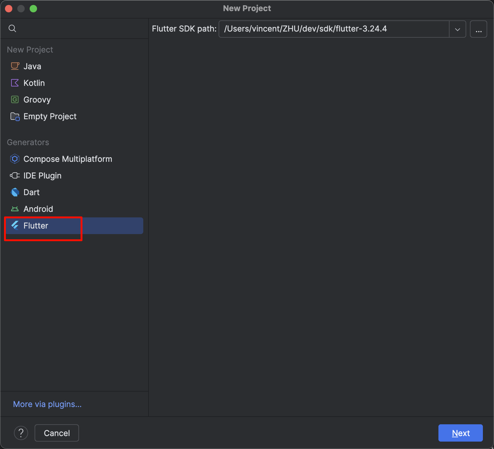
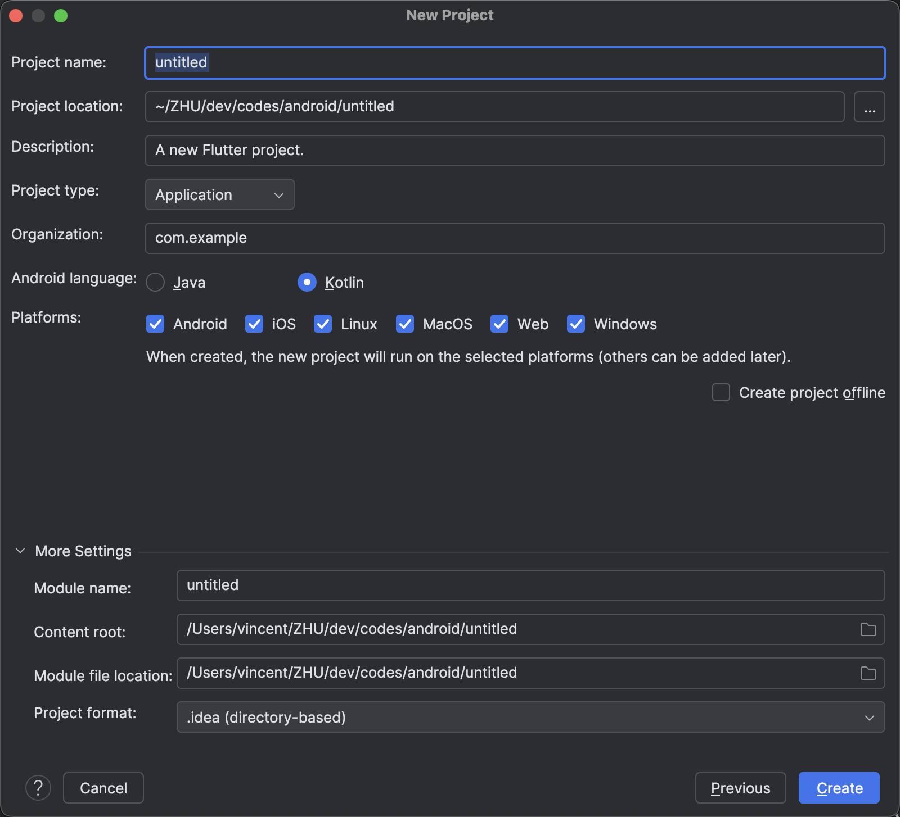

tags:: [[Android Studio]], [[Intellij IDEA]], [[Flutter]]
---

- ## 安装
	- [[Android Studio 环境搭建]] / [[Intellij IDEA 安装]]
	  logseq.order-list-type:: number
	- 搜索并安装 `flutter` 插件.
	  logseq.order-list-type:: number
- ## 创建项目
	- New Project
	  logseq.order-list-type:: number
		- Android Studio : File > New Flutter Project
		- Intellij IDEA: File > New Project
	- 选择项目类型, 选择 Flutter SDK 地址.
	  logseq.order-list-type:: number
		- 侧边栏记得选择 `Flutter` (如果没有, 说明没安装 `flutter` 插件).
		- {:height 521, :width 525}
	- 填写项目信息.
	  logseq.order-list-type:: number
		- 如果后续想要发布:
			- `Organization` 最好是你的域名倒过来.
			- `Organization`  和 `Project name` 拼起来最好就是 Android 的 `package name` 或 iOS 的 `Bundle ID` .
		- {:height 449, :width 523}
- ## 参考
	- [Flutter Docs - Android Studio and IntelliJ](https://docs.flutter.dev/tools/android-studio#opening-a-project-from-existing-source-code)
	  logseq.order-list-type:: number
		- 接下来看: Editing code and viewing issues (2025-10-17)
-