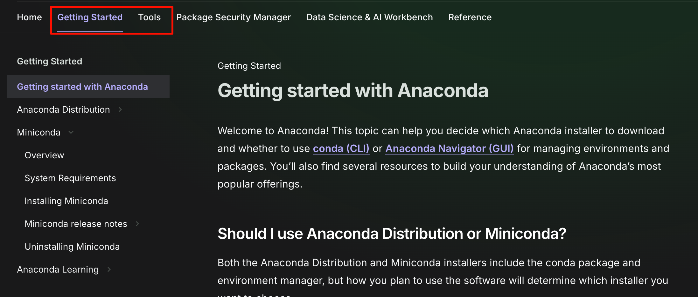

tags:: [[Anaconda]]
---

- ## 官网资料
	- [Anaconda 官网](https://www.anaconda.com/)
		- 官方课程: [Anaconda Learning](https://learning.anaconda.cloud/page/catalog)
		  logseq.order-list-type:: number
		- [Anaconda Docs](https://www.anaconda.com/docs/main)
		  logseq.order-list-type:: number
			- ==Home 已阅 (2025-03-30)==
			- {:height 401, :width 706}
			- [Getting Started](https://www.anaconda.com/docs/getting-started/getting-started)
			- [Tools](https://www.anaconda.com/docs/tools/main)
			- 其他几个 tab 不用看啦, 貌似基本都与 Anaconda 提供的云服务有关.
- ## 学习进度
	-