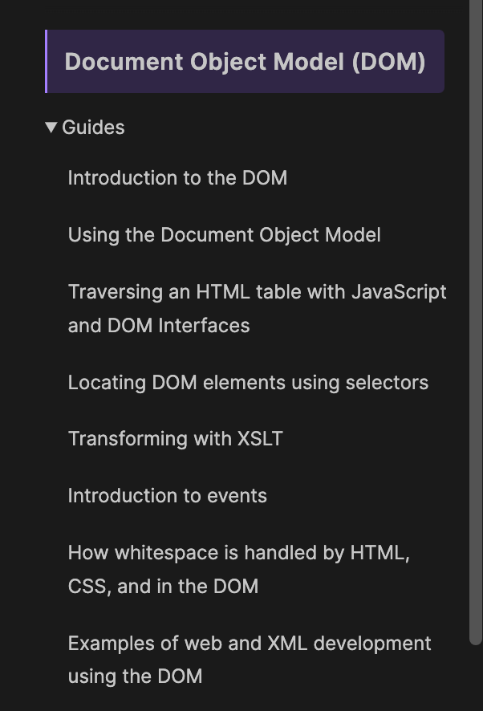

tags:: [[DOM]]
---

- ## 学习进度
	- [Document Object Model (DOM)](https://developer.mozilla.org/en-US/docs/Web/API/Document_Object_Model)
		- {:height 473, :width 283}
		- 看完 [Fundamental data types](https://developer.mozilla.org/en-US/docs/Web/API/Document_Object_Model/Introduction) 2025-02-15
		- 接下来看 [Using the Document Object Model](https://developer.mozilla.org/en-US/docs/Web/API/Document_Object_Model/Using_the_Document_Object_Model)
		-
- ## 学习资料
	- [Document Object Model (DOM)](https://developer.mozilla.org/en-US/docs/Web/API/Document_Object_Model)
	  logseq.order-list-type:: number
	- [DOM scripting introduction](https://developer.mozilla.org/en-US/docs/Learn_web_development/Core/Scripting/DOM_scripting)
	  logseq.order-list-type:: number