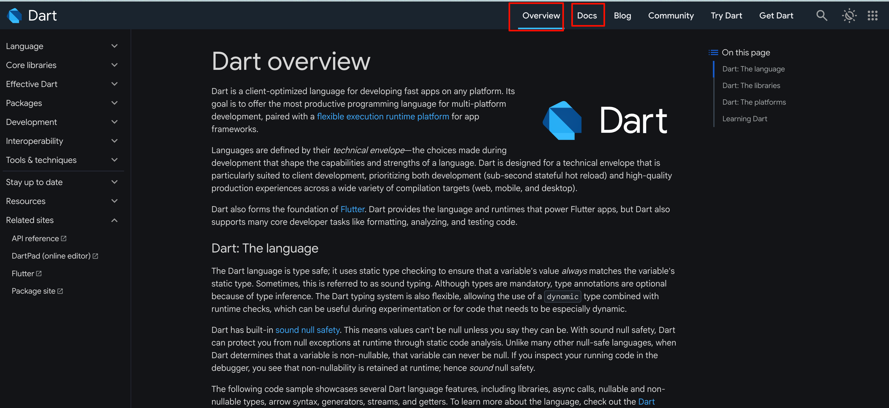

tags:: [[Dart]]
---

- ## 学习资源
	- [Dart 官网](https://dart.dev/)
	  logseq.order-list-type:: number
	- [Dart 中文官网](https://dart.cn/)
	  logseq.order-list-type:: number
- ## 学习进度
	- ### [Dart 官网](https://dart.dev/)
		- 
		- #### Get Dart ==已阅==
		- #### Overview ==已阅==
		- #### Docs
			- Language
				- 看完 Introduction, Variables, Comments
				- 接下来看 Operators .
			- Tools & techniques
				- Overview  ==已阅==
				- Editors & debuggers  ==已阅==
		-