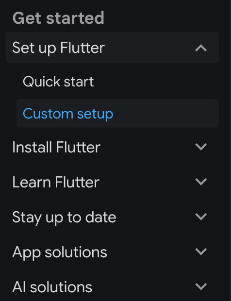

tags:: [[Flutter]]
---

- ## 官方资料
	- [Flutter Docs](https://docs.flutter.dev/)
	  logseq.order-list-type:: number
	- [Flutter Docs 中文](https://docs.flutter.cn/)
	  logseq.order-list-type:: number
- ## 学习进度
	- [Flutter Docs](https://docs.flutter.dev/)
	  logseq.order-list-type:: number
		- {:height 358, :width 266}
		- `Learn Flutter` >
			- 接下来看 `Learn the fundamentals > Widgets`
			-
			-
-