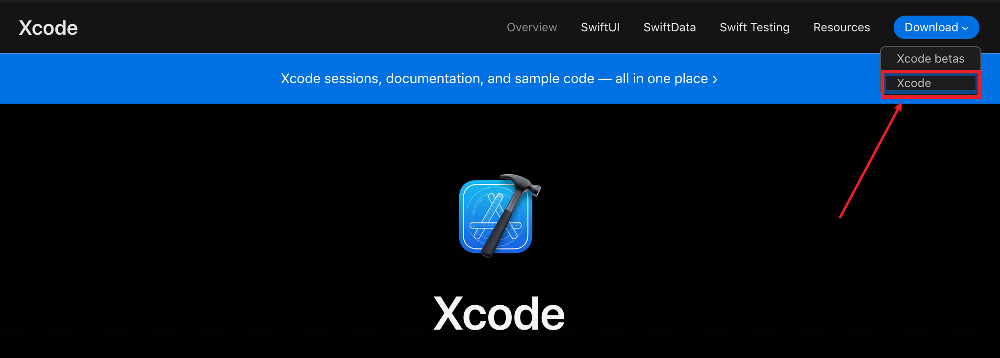
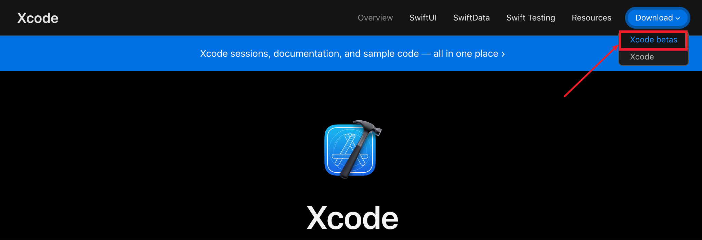
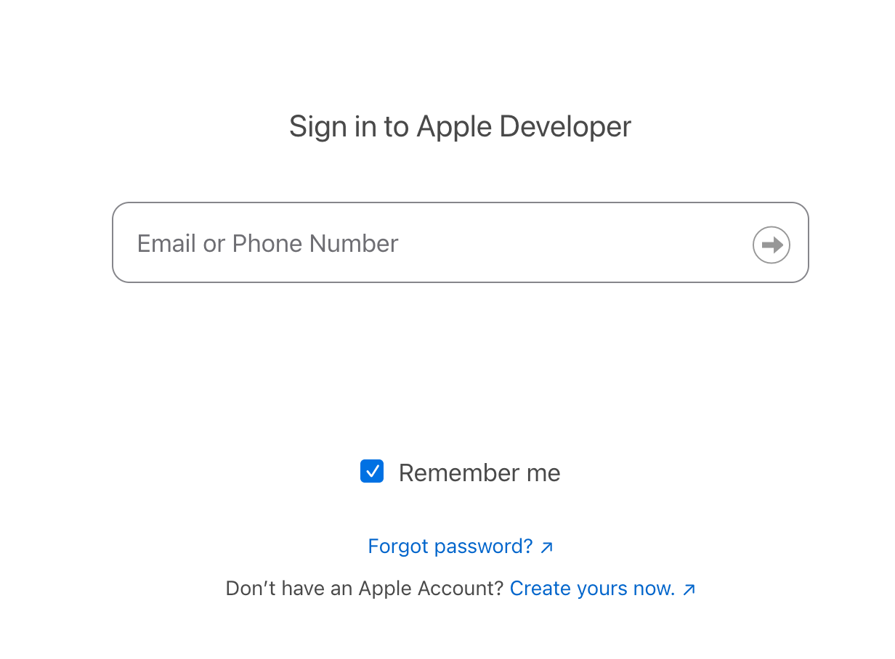
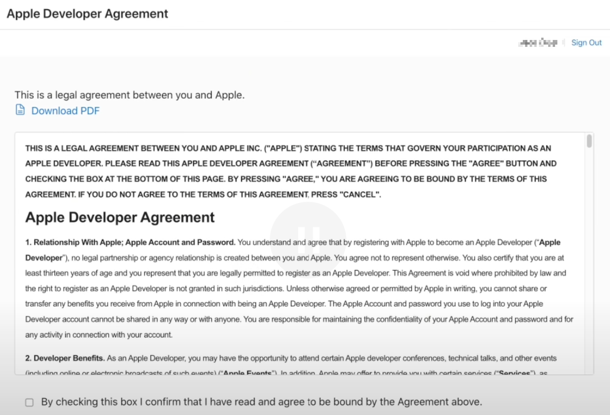
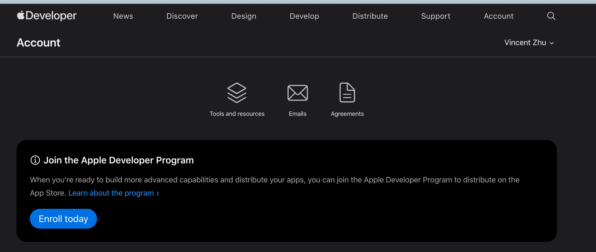
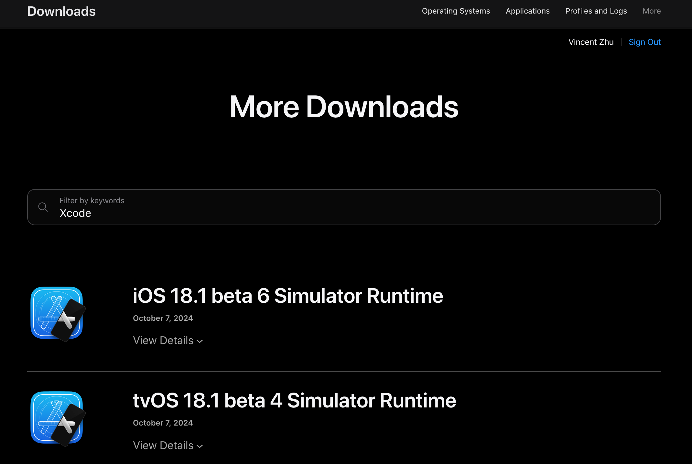
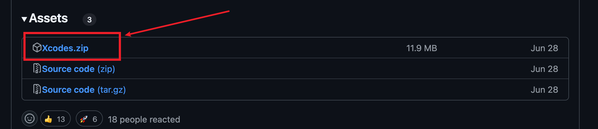
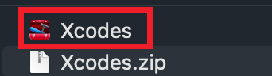
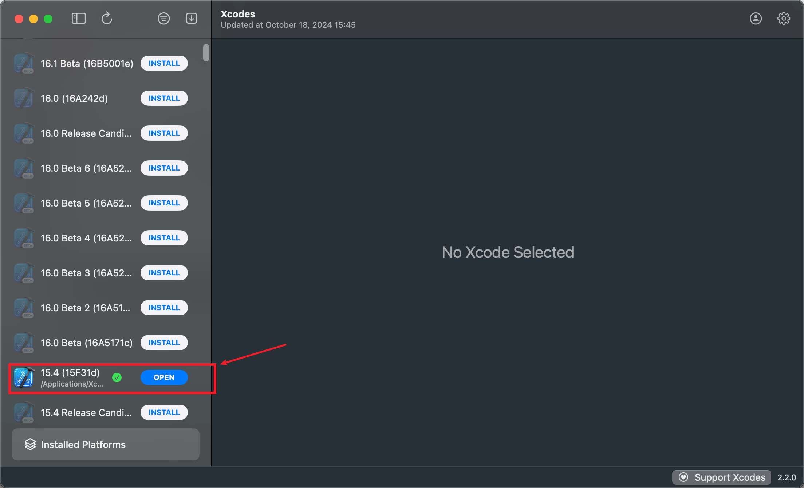

tags:: [[Xcode]]
---

- ## Xcode 版本与 macOS 版本
	- Xcode 依赖特定版本的 macOS , 所以安装高版本的 Xcode 的时, 可能会要求我们升级 macOS .
- ## 从 App Store 下载 (不推荐)
	- [Xcode 主页](https://developer.apple.com/xcode/) > 点击右上角 Download > 点击 Xcode
		- 
	- 此时, 会跳转到 [Xcode 的 App Store 下载页面](https://apps.apple.com/us/app/xcode/id497799835) .
	- 不建议从 App Store 下载, 因为:
		- 如果开启自动更新, 很多东西可能要重新抓, 导致一些问题.
		  logseq.order-list-type:: number
		- 我们希望电脑上有多个版本的 Xcode 供我们切换.
		  logseq.order-list-type:: number
- ## 从 Xcode 官网下载 (尚可, 但仍不方便)
	- [Xcode 主页](https://developer.apple.com/xcode/) > 点击右上角 Download > 点击 Xcode betas
	  logseq.order-list-type:: number
		- 
	- 此时, 会网站会跳转到 Apple 开发者登录界面.
	  logseq.order-list-type:: number
		- {:height 324, :width 642}
		- 如已拥有开发者账号, 则直接登录即可;
		- 如还未拥有开发者账号, 则先登录想赋予开发者权限的 Apple ID ; 登录之后, 会弹出如下协议, 我们点击同意并提交即可.
			- {:height 159, :width 744}
	- 登录之后, 可能会跳转到如下页面, 我们暂且不管, 直接访问 [Xcode betas Download 页面](https://developer.apple.com/download/all/?q=Xcode)
	  logseq.order-list-type:: number
		- 
	- Xcode betas Download 页面如下图所示, 有 Xcode 及其相关工具的多种版本可供下载
	  logseq.order-list-type:: number
		- {:height 469, :width 669}
		- 我们选择我们想要下载的版本即可 (正式版如下图所示) .
			- {:height 209, :width 632}
- ## 使用 Xcodes 下载 (推荐)
	- [Xcodes Github Repo](https://github.com/XcodesOrg/XcodesApp) > [Xcodes Releases](https://github.com/XcodesOrg/XcodesApp/releases) > 下载最新版本的 .zip 安装包
	  logseq.order-list-type:: number
		- 
	- 安装包解压后得到如下 APP , 将它拖到 Applications 目录中即可.
	  logseq.order-list-type:: number
		- 
	- 打开 Xcodes 后, 我们可以看到左侧有各种版本的 Xcode 供我们安装 (我在 App Store 安装的 Xcode 它也能识别).
	  logseq.order-list-type:: number
		- 
-
- ---
- ## 参考
	- [ChaoCode - [準備好你的 Xcode：使用 Xcodes 安裝 ＆ 手機測試環境設定]](https://www.youtube.com/watch?v=e6wF5UTcxkU&t=836s)
	  logseq.order-list-type:: number
	- logseq.order-list-type:: number
-